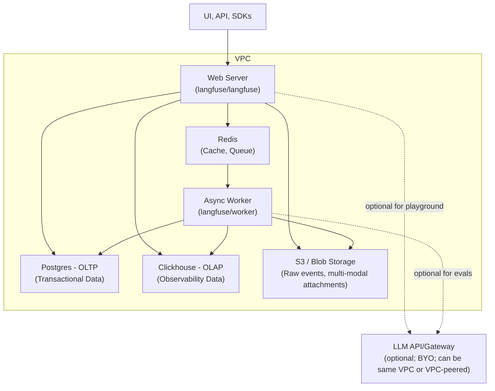

# GenAI Shopping Assistant

A multi-agent LLM system that serves as an intelligent shopping companion for e-commerce websites. Users interact conversationally while a central `RouterAgent` directs each message to one of three specialist agents — product search, shopping actions, or customer service.

---

## Table of Contents

1. [Setting Up Dev Environment](#1-setting-up-dev-environment)
2. [Deployment](#2-deployment)
3. [Service Configuration](#3-service-configuration)
4. [How to Run](#4-how-to-run)
5. [Repository Structure](#5-repository-structure)
6. [Architecture](#6-architecture)
7. [Components](#7-components)
8. [Observability](#8-observability)
9. [Example Usage](#9-example-usage)

---

## 1. Setting Up Dev Environment

### Prerequisites

- Python 3.12
- [`uv`](https://docs.astral.sh/uv/) — virtual environment and dependency management

### Setup Steps

Virtual environment operations are managed using the `project` CLI. Follow these steps from the **repo root** to configure your development environment:

#### 1. Setup direnv (semi-manual)

First, refer to [`.claude/rules/direnv-setup.md`](.claude/rules/direnv-setup.md) for the one-time machine pre-setup (installing `direnv` and configuring your shell). Once that's complete, generate and allow the `.envrc` files across all components:

```bash
project direnv setup
```

#### 2. Setup project CLI

Bootstrap the monorepo `project` CLI utility:

```bash
make setup-project-cli
```

*Make sure to activate the root venv in your current terminal session so that the `project` CLI is available in your shell:*

```bash
source .venv/bin/activate
```

#### 3. Create all dev venvs

Create the development virtual environments for all components at once:

```bash
project venv create --all --group dev --overwrite
```

#### 4. Switch all components to dev venvs

Switch all component virtual environments to the target `dev` group:

```bash
project venv switch --all --target dev --include-root
```

> See [`.claude/rules/venv-management.md`](.claude/rules/venv-management.md) for full venv management documentation including switching, cleaning, and repairing environments.

---

## 2. Deployment

The application is deployed using Docker Compose. All compose files and environment configuration live under `platform/`.

### Docker Compose structure

The app stack uses two compose files in `platform/app/`:

| File | Purpose |
|---|---|
| `docker-compose.yml` | Base configuration — defines all services, ports, and prod build targets |
| `docker-compose.dev.yml` | Dev overlay — overrides build targets to `dev` and adds source volume mounts |

They are layered together by the Make targets using `-f docker-compose.yml -f docker-compose.dev.yml`.

### Services

| Service | Description | Image | Forwarded Port |
|---|---|---|---|
| `weaviate` | Vector database for semantic product search | `weaviate:1.34.0` | `8080` (HTTP), `50051` (gRPC) |
| `ollama` | Local LLM inference for Weaviate text embeddings | `ollama:0.12.9` | `11434` |
| `shopping-assistant` | Core GenAI shopping service (FastAPI) | `shopping-assistant:prod/dev` | `8010` |
| `ecom-backend` | Auxiliary e-commerce API (FastAPI) | `ecom-backend:prod/dev` | `8000` |

### Environment files

| File | Used by | Purpose |
|---|---|---|
| `platform/app/.env` | All `app-*` targets | Shared prod values (API keys, ports, Langfuse keys) |
| `platform/app/.env.dev` | `app-dev` target | Dev overlay (e.g. different `LANGFUSE_BASE_URL` port) |
| `platform/observability/.env` | All `langfuse-*` targets | Langfuse infrastructure config |
| `platform/observability/.env.dev` | `langfuse-dev` target | Langfuse dev overlay |

### Dev environment

The `app-dev` target layers `docker-compose.dev.yml` on top of `docker-compose.yml`. This switches the build target to `dev` for the custom services, which:

- **Volume mounts** the local source directories into the container — `services/shopping-assistant`, `packages/shopping-assistant`, and `services/ecom-backend` are all mounted at their expected paths inside the image
- Installs dependencies as **editable installs** (`-e`), so Python picks up local code changes immediately
- Runs `uvicorn` with `--reload`, enabling a fast dev loop without image rebuilds

```bash
make app-dev SERVICES=shopping-assistant,ecom-backend
```

### Prod environment

The `app-prod` target uses only `docker-compose.yml`. The prod build:

- Copies source directly into the image (no volume mounts)
- Installs with `uv sync --locked --no-dev` — uses the lock file, no dev deps, no editable installs
- Runs `uvicorn` without `--reload`

```bash
make app-prod SERVICES=shopping-assistant,ecom-backend
```

---

## 3. Service Configuration

Environment variables are split across two locations under `platform/`:

### `platform/app/` — App stack

Copy the example files and fill in your values before running:

```bash
cp platform/app/.env.example platform/app/.env
cp platform/app/.env.dev.example platform/app/.env.dev
```

**`platform/app/.env.example`** (prod, also loaded in dev):

| Variable | Description |
|---|---|
| `OPENAI_API_KEY` | OpenAI API key |
| `CO_API_KEY` | Cohere API key |
| `ANTHROPIC_API_KEY` | Anthropic API key |
| `OPENAI_BASE_URL` | Custom OpenAI-compatible endpoint (optional) |
| `LANGFUSE_PUBLIC_KEY` | Langfuse project public key |
| `LANGFUSE_SECRET_KEY` | Langfuse project secret key |
| `LANGFUSE_BASE_URL` | Langfuse server URL |
| `WEAVIATE_HTTP_PORT` | Weaviate HTTP forwarded port (default `8080`) |
| `WEAVIATE_HTTP_HOST` | Weaviate hostname (default `weaviate`) |
| `WEAVIATE_GRPC_PORT` | Weaviate gRPC forwarded port (default `50051`) |
| `WEAVIATE_GRPC_HOST` | Weaviate gRPC hostname (default `weaviate`) |
| `OLLAMA_PORT` | Ollama forwarded port (default `11434`) |
| `SHOPPING_ASSISTANT_PORT` | Shopping assistant service port (default `8010`) |
| `ECOM_API_PORT` | Ecom backend service port (default `8000`) |

**`platform/app/.env.dev.example`** (dev overlay, loaded in addition to `.env`):

Overrides `LANGFUSE_BASE_URL` to point to the dev observability stack port.

### `platform/observability/` — Observability stack (Langfuse)

```bash
cp platform/observability/.env.example platform/observability/.env
cp platform/observability/.env.dev.example platform/observability/.env.dev
```

Configures Langfuse infrastructure ports (web, worker, Postgres, ClickHouse, MinIO, Redis). See the example file for defaults.

---

## 4. How to Run

All instructions assume commands are executed from the **repository root** unless specified otherwise.

### Prerequisites & Parameters
Ensure you have the following parameters ready before beginning:
- `{env}`: Your target environment (typically `dev` or `prod`).
- `ECOM_BACKEND_DB_NAME`: The base filename for your e-commerce database.

---

### Step 0: Initialize Environment Files
Copy the template files to create the active configuration profiles for both the core application and the observability suite:
```bash
# Core App
cp platform/app/.env.example platform/app/.env
cp platform/app/.env.dev.example platform/app/.env.dev

# Observability (Langfuse)
cp platform/observability/.env.example platform/observability/.env
cp platform/observability/.env.dev.example platform/observability/.env.dev
```

### Step 1: Bootstrap the Project CLI
Initialize the root virtual environment and install the monorepo's `project` CLI tool:
```bash
make setup-project-cli
```
*Note: Make sure to activate the root virtual environment in your current shell session so the `project` CLI is natively available:*
```bash
source .venv/bin/activate
```

### Step 2: Configure Environment Auto-Loading (`direnv`)
Set up and authorize the local environment configurations across all components.
```bash
project direnv setup --all
```

### Step 3: Create Component Virtual Environments
Generate isolation containers for all components tailored to your active environment (`{env}`):
```bash
project venv create --all --group {env} --overwrite
```

### Step 4: Switch Active Environments
Bind all component environments to the newly-created environment group:
```bash
project venv switch --all --target {env} --include-root
```

### Step 5: Clean Docker State
If performing a fresh clean start, tear down existing docker containers and remove their volume mounts using the unified `Makefile` commands:
```bash
# Tear down all stacks (app + telemetry) and their volume mounts simultaneously
make local-run-{env} CMD="down -v"

# Or tear down specific components individually
make app-{env} CMD="down -v"
make langfuse-{env} CMD="down -v"
```

### Step 6: Delete Dangling Docker Images
Optionally prune existing local images to avoid layer/cache conflicts:
```bash
docker images -q | xargs docker rmi -f
```

### Step 7: Launch the Observability Stack (Langfuse)
Start the background telemetry infrastructure:
```bash
make langfuse-{env}
```

### Step 8: Initialize and Seed Ecom Backend DB
Export variables, navigate to the `ecom-backend` service, and run migrations/seeders against SQLite:
```bash
# 1. Define configuration vars
export ECOM_BACKEND_DB_NAME="ecom_backend" # Or your preferred name
export REPO_ROOT=$(pwd)

# 2. Enter the service context
cd services/ecom-backend

# 3. Apply database schema migrations
VIRTUAL_ENV=.venv uv run --active alembic upgrade head

# 4. Ingest raw product catalog
VIRTUAL_ENV=.venv uv run --active scripts/ingest_product_data.py \
  --reset-db \
  --db-url sqlite:///data/${ECOM_BACKEND_DB_NAME}.db \
  --data-file products_extended.csv \
  --data-dir "${REPO_ROOT}/data"

# 5. Seed default admin user
VIRTUAL_ENV=.venv uv run --active scripts/create_admin_user.py \
  --default \
  --db-url sqlite:///data/${ECOM_BACKEND_DB_NAME}.db

# 6. Return to repo root
cd "${REPO_ROOT}"
```

### Step 9: Validate Ecom API Service
Launch the Docker stack for `ecom-backend` and run the endpoint test suites:
```bash
# Start ecom-backend service
make app-{env} SERVICES=ecom-backend

# Note the ECOM_API_PORT configured in your env file (defaults to 8000)
# Execute api test suites (passing the active port as argument)
bash services/ecom-backend/tests/api/test_products_api.sh 8000
bash services/ecom-backend/tests/api/test_users_api.sh 8000
bash services/ecom-backend/tests/api/test_carts_api.sh 8000
```

### Step 10: Configure Local LLM Support (Ollama)
Start Ollama to handle vector embeddings and pull down the target embedder model:
```bash
# Start Ollama service
make app-{env} SERVICES=ollama

# Pull the specific embedding model inside the container
docker exec -it app-{env}-ollama-1 ollama pull nomic-embed-text

# Verify model accessibility
docker exec -it app-{env}-ollama-1 ollama list
```

### Step 11: Ingest Products Into Vector DB
Run the ETL pipeline to read products from SQLite and build vector embeddings in Weaviate:
```bash
# Start Weaviate instance
make app-{env} SERVICES=weaviate

# Run vector ingestion target
make ingest-products-vectordb ENV={env} ECOM_BACKEND_DB_SQLITE_PATH=services/ecom-backend/data/${ECOM_BACKEND_DB_NAME}.db
```

### Step 12: Boot Core Shopping Assistant App
Bring up the multi-agent conversational engine service:
```bash
make app-{env} SERVICES=shopping-assistant
```

---

## 5. Example Usage

Multi-turn conversation with `user_id=1`, `thread_id=1`, covering all four agents.

**Turn 1 — CustomerServiceAgent (greeting)**

```bash
curl -X POST 'http://localhost:8010/chat' \
  -H 'Content-Type: application/json' \
  -d '{"user_id": "1", "query": "Hello!", "thread_id": "1"}'
```

```json
{
    "response": "Customer Service Agent: Hello! How can I assist you today?"
}
```

**Turn 2 — ProductSearchAgent (product discovery)**

```bash
curl -X POST 'http://localhost:8010/chat' \
  -H 'Content-Type: application/json' \
  -d '{"user_id": "1", "query": "I am looking for black sunglasses under 100 dollars", "thread_id": "1"}'
```

```json
{
    "response": "Product Search Agent: I found the following products based on your query:\n\n1. trendy-tapered-sunglasses ($49.99)\n2. futura-sunglasses-in-aviator-style ($99.99)\n3. ivory-glitter-cat-eye-sunglasses ($99.99)\n4. vivid-rose-gold-aviator-sunglasses ($69.99)\n5. kaleidoscope-mirror-sunglasses ($49.99)"
}
```

**Turn 3 — ShoppingActionsAgent (add to cart)**

```bash
curl -X POST 'http://localhost:8010/chat' \
  -H 'Content-Type: application/json' \
  -d '{"user_id": "1", "query": "Can you add the first one to my cart?", "thread_id": "1"}'
```

```json
{
    "response": "Shopping Actions Agent: The \"Trendy Tapered Sunglasses\" have been successfully added to your cart.\n\n### Current Cart:\n| Sno | Product                    | Qty | Amount  |\n|-----|----------------------------|-----|---------|\n| 1   | Southwest Bracelet         | 3   | $509.97 |\n| 2   | Floral Choker Necklace     | 2   | $259.98 |\n| 3   | Ivy Leaf Embroidered Skirt | 1   | $189.99 |\n| 4   | Trendy Tapered Sunglasses  | 2   | $99.98  |\n\n**Total: $1059.92**"
}
```

**Turn 4 — CustomerServiceAgent (return policy)**

```bash
curl -X POST 'http://localhost:8010/chat' \
  -H 'Content-Type: application/json' \
  -d '{"user_id": "1", "query": "What is your return policy?", "thread_id": "1"}'
```

```json
{
    "response": "Customer Service Agent: Our return policy allows you to return most items within 30 days of receiving your order. Items must be unused, in their original packaging, and include all tags and labels. To initiate a return, visit the returns section of our website or contact customer service."
}
```

---

## 6. Repository Structure

```
genai-shopping-assistant/
├── packages/
│   └── shopping-assistant/           # Core multi-agent LLM package
│       ├── src/shopping_assistant/   # Agent definitions, graph, tools, config
│       ├── pyproject.toml
│       └── README.md
│
├── services/
│   ├── shopping-assistant/           # Core service: FastAPI app wrapping the package
│   │   ├── app.py
│   │   ├── Dockerfile
│   │   ├── pyproject.toml
│   │   └── README.md
│   ├── ecom-backend/                 # Auxiliary service: e-commerce API (products, carts, users)
│   │   ├── app.py
│   │   ├── Dockerfile
│   │   ├── domains/
│   │   ├── pyproject.toml
│   │   └── README.md
│   └── product-retriever/            # Auxiliary service: vector search (placeholder)
│
├── platform/
│   ├── app/                          # App stack deployment
│   │   ├── docker-compose.yml        # Base (prod) compose
│   │   ├── docker-compose.dev.yml    # Dev overlay (volume mounts, dev targets)
│   │   ├── .env.example
│   │   └── .env.dev.example
│   └── observability/                # Langfuse observability stack
│       ├── docker-compose.langfuse.yml
│       ├── .env.example
│       └── .env.dev.example
│
├── data/                             # Product datasets (CSV)
├── notebooks/                        # Jupyter notebooks (PoC, misc)
├── scripts/                          # Monorepo tooling (venv management, direnv)
├── playground/                       # Ad-hoc exploration scripts
├── Makefile
└── CLAUDE.md
```

---

## 7. Architecture

The `shopping-assistant` service exposes a `POST /chat` endpoint that drives the multi-agent LangGraph pipeline.


---

## 8. Components

### `packages/shopping-assistant` — Core LLM Package

The heart of the system. A Python package implementing the multi-agent LangGraph pipeline with four agents (`RouterAgent`, `ProductSearchAgent`, `ShoppingActionsAgent`, `CustomerServiceAgent`), the `Chat` high-level API, and `EcomAPIClient` for e-commerce operations.

> See [`packages/shopping-assistant/README.md`](packages/shopping-assistant/README.md) for full documentation.

### `services/shopping-assistant` — Core Service

A FastAPI service that wraps the `shopping-assistant` package and exposes it as an HTTP API (`POST /chat`). Uses a multi-stage Dockerfile with `dev` and `prod` targets.

> See [`services/shopping-assistant/README.md`](services/shopping-assistant/README.md) for full documentation.

### `services/ecom-backend` — Auxiliary E-commerce API

A FastAPI service providing product, cart, and user management backed by SQLite. Demonstrates how the GenAI Shopping Assistant integrates with an e-commerce backend.

> **Note**: In the target architecture (v1.x+), this service will be replaceable with standard e-commerce platforms (Shopify, WooCommerce) via Bring-YOS integrations.

> See [`services/ecom-backend/README.md`](services/ecom-backend/README.md) for full documentation.

### Out-of-the-box Services

| Service | Purpose | Image |
|---|---|---|
| [Weaviate](https://weaviate.io) | Vector database for semantic product search | `cr.weaviate.io/semitechnologies/weaviate` |
| [Ollama](https://ollama.com) | Local LLM inference for Weaviate text embeddings (`text2vec-ollama`) | `ollama/ollama` |

---

## 9. Observability

The application uses [Langfuse](https://langfuse.com) to track LLM traces and [Logfire](https://logfire.dev) to track logs. These are optional but recommended for monitoring agent behaviour.

| Variable | Description | Default |
|---|---|---|
| `LANGFUSE_PUBLIC_KEY` | Langfuse project public key | — |
| `LANGFUSE_SECRET_KEY` | Langfuse project secret key | — |
| `LANGFUSE_BASE_URL` | Langfuse server URL | `http://localhost:3000` |

The Langfuse stack is self-hosted via `platform/observability/docker-compose.langfuse.yml` and includes:

| Service | Description | Default Port |
|---|---|---|
| `langfuse-web` | Langfuse web UI | `3000` |
| `langfuse-worker` | Async event processing worker | `3030` |
| `postgres` | OLTP — transactional data | `5432` |
| `clickhouse` | OLAP — observability data | `8123` |
| `redis` | Cache and ingestion queue | `6379` |
| `minio` | S3-compatible blob storage (raw events, media) | `9090` |

