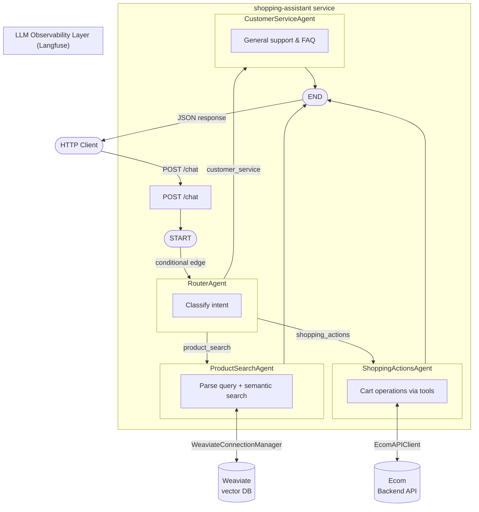

# GenAI Shopping Assistant

A multi-agent LLM system that serves as an intelligent shopping companion for e-commerce websites. Users interact conversationally while a central `RouterAgent` directs each message to one of three specialist agents — product search, shopping actions, or customer service.

---

## Table of Contents

1. [Setting Up Dev Environment](#1-setting-up-dev-environment)
2. [Deployment](#2-deployment)
3. [Service Configuration](#3-service-configuration)
4. [How to Run](#4-how-to-run)
5. [Repository Structure](#5-repository-structure)
6. [Architecture](#6-architecture)
7. [Components](#7-components)
8. [Observability](#8-observability)
9. [Example Usage](#9-example-usage)

---

## 1. Setting Up Dev Environment

### Prerequisites

- Python 3.12
- [`uv`](https://docs.astral.sh/uv/) — virtual environment and dependency management

### Create virtual environments (recommended)

The monorepo uses Make targets for all venv operations. From the **repo root**:

```bash
# Create dev venvs for all components at once
make venv-create-all GROUP=dev

# Or create for a single component
make venv-create COMPONENT=packages/shopping-assistant GROUP=dev
make venv-create COMPONENT=services/shopping-assistant GROUP=dev
make venv-create COMPONENT=services/ecom-backend GROUP=dev
```

### Activate a virtual environment

```bash
# Activate directly (without switching)
source packages/shopping-assistant/.venv-dev/bin/activate

# Or switch + activate (sets .venv symlink)
make venv-switch COMPONENT=packages/shopping-assistant TARGET=dev
source packages/shopping-assistant/.venv/bin/activate
```

> See [`.claude/rules/venv-management.md`](.claude/rules/venv-management.md) for full venv management documentation including switching, cleaning, and repairing environments.

---

## 2. Deployment

The application is deployed using Docker Compose. All compose files and environment configuration live under `platform/`.

### Docker Compose structure

The app stack uses two compose files in `platform/app/`:

| File | Purpose |
|---|---|
| `docker-compose.yml` | Base configuration — defines all services, ports, and prod build targets |
| `docker-compose.dev.yml` | Dev overlay — overrides build targets to `dev` and adds source volume mounts |

They are layered together by the Make targets using `-f docker-compose.yml -f docker-compose.dev.yml`.

### Services

| Service | Description | Image | Forwarded Port |
|---|---|---|---|
| `weaviate` | Vector database for semantic product search | `weaviate:1.34.0` | `8080` (HTTP), `50051` (gRPC) |
| `ollama` | Local LLM inference for Weaviate text embeddings | `ollama:0.12.9` | `11434` |
| `shopping-assistant` | Core GenAI shopping service (FastAPI) | `shopping-assistant:prod/dev` | `8010` |
| `ecom-backend` | Auxiliary e-commerce API (FastAPI) | `ecom-backend:prod/dev` | `8000` |

### Environment files

| File | Used by | Purpose |
|---|---|---|
| `platform/app/.env` | All `app-*` targets | Shared prod values (API keys, ports, Langfuse keys) |
| `platform/app/.env.dev` | `app-dev` target | Dev overlay (e.g. different `LANGFUSE_BASE_URL` port) |
| `platform/observability/.env` | All `langfuse-*` targets | Langfuse infrastructure config |
| `platform/observability/.env.dev` | `langfuse-dev` target | Langfuse dev overlay |

### Dev environment

The `app-dev` target layers `docker-compose.dev.yml` on top of `docker-compose.yml`. This switches the build target to `dev` for the custom services, which:

- **Volume mounts** the local source directories into the container — `services/shopping-assistant`, `packages/shopping-assistant`, and `services/ecom-backend` are all mounted at their expected paths inside the image
- Installs dependencies as **editable installs** (`-e`), so Python picks up local code changes immediately
- Runs `uvicorn` with `--reload`, enabling a fast dev loop without image rebuilds

```bash
make app-dev SERVICES=shopping-assistant,ecom-backend
```

### Prod environment

The `app-prod` target uses only `docker-compose.yml`. The prod build:

- Copies source directly into the image (no volume mounts)
- Installs with `uv sync --locked --no-dev` — uses the lock file, no dev deps, no editable installs
- Runs `uvicorn` without `--reload`

```bash
make app-prod SERVICES=shopping-assistant,ecom-backend
```

---

## 3. Service Configuration

Environment variables are split across two locations under `platform/`:

### `platform/app/` — App stack

Copy the example files and fill in your values before running:

```bash
cp platform/app/.env.example platform/app/.env
cp platform/app/.env.dev.example platform/app/.env.dev
```

**`platform/app/.env.example`** (prod, also loaded in dev):

| Variable | Description |
|---|---|
| `OPENAI_API_KEY` | OpenAI API key |
| `CO_API_KEY` | Cohere API key |
| `ANTHROPIC_API_KEY` | Anthropic API key |
| `OPENAI_BASE_URL` | Custom OpenAI-compatible endpoint (optional) |
| `LANGFUSE_PUBLIC_KEY` | Langfuse project public key |
| `LANGFUSE_SECRET_KEY` | Langfuse project secret key |
| `LANGFUSE_BASE_URL` | Langfuse server URL |
| `WEAVIATE_HTTP_PORT` | Weaviate HTTP forwarded port (default `8080`) |
| `WEAVIATE_HTTP_HOST` | Weaviate hostname (default `weaviate`) |
| `WEAVIATE_GRPC_PORT` | Weaviate gRPC forwarded port (default `50051`) |
| `WEAVIATE_GRPC_HOST` | Weaviate gRPC hostname (default `weaviate`) |
| `OLLAMA_PORT` | Ollama forwarded port (default `11434`) |
| `SHOPPING_ASSISTANT_PORT` | Shopping assistant service port (default `8010`) |
| `ECOM_API_PORT` | Ecom backend service port (default `8000`) |

**`platform/app/.env.dev.example`** (dev overlay, loaded in addition to `.env`):

Overrides `LANGFUSE_BASE_URL` to point to the dev observability stack port.

### `platform/observability/` — Observability stack (Langfuse)

```bash
cp platform/observability/.env.example platform/observability/.env
cp platform/observability/.env.dev.example platform/observability/.env.dev
```

Configures Langfuse infrastructure ports (web, worker, Postgres, ClickHouse, MinIO, Redis). See the example file for defaults.

---

## 4. How to Run

All run commands are invoked from the **repo root** via Make targets.

### Step 1 — Configure environment variables

Fill in `platform/app/.env` (and optionally `.env.dev`) as described in [Service Configuration](#3-service-configuration).

### Step 2 — Start the stack

| Command | What it runs |
|---|---|
| `make langfuse-dev` | Observability stack only (dev) |
| `make langfuse-prod` | Observability stack only (prod) |
| `make app-dev` | App stack only — weaviate, ollama, shopping-assistant, ecom-backend (dev) |
| `make app-prod` | App stack only (prod) |
| `make local-run-dev` | Full stack — `langfuse-dev` + `app-dev` |
| `make local-run-prod` | Full stack — `langfuse-prod` + `app-prod` |

To run a subset of app services, pass `SERVICES`:

```bash
make app-dev SERVICES=shopping-assistant,ecom-backend
```

### Step 3 — Ingest product data

After Weaviate is running, ingest product data into the vector store:

```bash
make ingest-products-vectordb
```

---

## 5. Repository Structure

```
genai-shopping-assistant/
├── packages/
│   └── shopping-assistant/           # Core multi-agent LLM package
│       ├── src/shopping_assistant/   # Agent definitions, graph, tools, config
│       ├── pyproject.toml
│       └── README.md
│
├── services/
│   ├── shopping-assistant/           # Core service: FastAPI app wrapping the package
│   │   ├── app.py
│   │   ├── Dockerfile
│   │   ├── pyproject.toml
│   │   └── README.md
│   ├── ecom-backend/                 # Auxiliary service: e-commerce API (products, carts, users)
│   │   ├── app.py
│   │   ├── Dockerfile
│   │   ├── domains/
│   │   ├── pyproject.toml
│   │   └── README.md
│   └── product-retriever/            # Auxiliary service: vector search (placeholder)
│
├── platform/
│   ├── app/                          # App stack deployment
│   │   ├── docker-compose.yml        # Base (prod) compose
│   │   ├── docker-compose.dev.yml    # Dev overlay (volume mounts, dev targets)
│   │   ├── .env.example
│   │   └── .env.dev.example
│   └── observability/                # Langfuse observability stack
│       ├── docker-compose.langfuse.yml
│       ├── .env.example
│       └── .env.dev.example
│
├── data/                             # Product datasets (CSV)
├── notebooks/                        # Jupyter notebooks (PoC, misc)
├── scripts/                          # Monorepo tooling (venv management, direnv)
├── playground/                       # Ad-hoc exploration scripts
├── Makefile
└── CLAUDE.md
```

---

## 6. Architecture

The `shopping-assistant` service exposes a `POST /chat` endpoint that drives the multi-agent LangGraph pipeline.



---

## 7. Components

### `packages/shopping-assistant` — Core LLM Package

The heart of the system. A Python package implementing the multi-agent LangGraph pipeline with four agents (`RouterAgent`, `ProductSearchAgent`, `ShoppingActionsAgent`, `CustomerServiceAgent`), the `Chat` high-level API, and `EcomAPIClient` for e-commerce operations.

> See [`packages/shopping-assistant/README.md`](packages/shopping-assistant/README.md) for full documentation.

### `services/shopping-assistant` — Core Service

A FastAPI service that wraps the `shopping-assistant` package and exposes it as an HTTP API (`POST /chat`). Uses a multi-stage Dockerfile with `dev` and `prod` targets.

> See [`services/shopping-assistant/README.md`](services/shopping-assistant/README.md) for full documentation.

### `services/ecom-backend` — Auxiliary E-commerce API

A FastAPI service providing product, cart, and user management backed by SQLite. Demonstrates how the GenAI Shopping Assistant integrates with an e-commerce backend.

> **Note**: In the target architecture (v1.x+), this service will be replaceable with standard e-commerce platforms (Shopify, WooCommerce) via Bring-YOS integrations.

> See [`services/ecom-backend/README.md`](services/ecom-backend/README.md) for full documentation.

### Out-of-the-box Services

| Service | Purpose | Image |
|---|---|---|
| [Weaviate](https://weaviate.io) | Vector database for semantic product search | `cr.weaviate.io/semitechnologies/weaviate` |
| [Ollama](https://ollama.com) | Local LLM inference for Weaviate text embeddings (`text2vec-ollama`) | `ollama/ollama` |

---

## 8. Observability

The application uses [Langfuse](https://langfuse.com) to track LLM traces and [Logfire](https://logfire.dev) to track logs. These are optional but recommended for monitoring agent behaviour.

| Variable | Description | Default |
|---|---|---|
| `LANGFUSE_PUBLIC_KEY` | Langfuse project public key | — |
| `LANGFUSE_SECRET_KEY` | Langfuse project secret key | — |
| `LANGFUSE_BASE_URL` | Langfuse server URL | `http://localhost:3000` |

The Langfuse stack is self-hosted via `platform/observability/docker-compose.langfuse.yml` and includes:

| Service | Description | Default Port |
|---|---|---|
| `langfuse-web` | Langfuse web UI | `3000` |
| `langfuse-worker` | Async event processing worker | `3030` |
| `postgres` | OLTP — transactional data | `5432` |
| `clickhouse` | OLAP — observability data | `8123` |
| `redis` | Cache and ingestion queue | `6379` |
| `minio` | S3-compatible blob storage (raw events, media) | `9090` |

```mermaid
flowchart TB
    User["UI, API, SDKs"]
    subgraph vpc["VPC"]
        Web["Web Server<br/>(langfuse/langfuse)"]
        Worker["Async Worker<br/>(langfuse/worker)"]
        Postgres@{ img: "/images/logos/postgres_icon.svg", label: "Postgres - OLTP\n(Transactional Data)", pos: "b", w: 60, h: 60, constraint: "on" }
        Cache@{ img: "/images/logos/redis_icon.png", label: "Redis\n(Cache, Queue)", pos: "b", w: 60, h: 60, constraint: "on" }
        Clickhouse@{ img: "/images/logos/clickhouse_icon.svg", label: "Clickhouse - OLAP\n(Observability Data)", pos: "b", w: 60, h: 60, constraint: "on" }
        S3@{ img: "/images/logos/s3_icon.svg", label: "S3 / Blob Storage\n(Raw events, multi-modal attachments)", pos: "b", w: 60, h: 60, constraint: "on" }
    end
    LLM["LLM API/Gateway<br/>(optional; BYO; can be same VPC or VPC-peered)"]

    User --> Web
    Web --> S3
    Web --> Postgres
    Web --> Cache
    Web --> Clickhouse
    Web -..->|"optional for playground"| LLM

    Cache --> Worker
    Worker --> Clickhouse
    Worker --> Postgres
    Worker --> S3
    Worker -..->|"optional for evals"| LLM
```

---

## 9. Example Usage

Multi-turn conversation with `user_id=1`, `thread_id=1`, covering all four agents.

**Turn 1 — CustomerServiceAgent (greeting)**

```bash
curl -X POST 'http://localhost:8010/chat' \
  -H 'Content-Type: application/json' \
  -d '{"user_id": "1", "query": "Hello!", "thread_id": "1"}'
```

```json
{
    "response": "Customer Service Agent: Hello! How can I assist you today?"
}
```

**Turn 2 — ProductSearchAgent (product discovery)**

```bash
curl -X POST 'http://localhost:8010/chat' \
  -H 'Content-Type: application/json' \
  -d '{"user_id": "1", "query": "I am looking for black sunglasses under 100 dollars", "thread_id": "1"}'
```

```json
{
    "response": "Product Search Agent: I found the following products based on your query:\n\n1. trendy-tapered-sunglasses ($49.99)\n2. futura-sunglasses-in-aviator-style ($99.99)\n3. ivory-glitter-cat-eye-sunglasses ($99.99)\n4. vivid-rose-gold-aviator-sunglasses ($69.99)\n5. kaleidoscope-mirror-sunglasses ($49.99)"
}
```

**Turn 3 — ShoppingActionsAgent (add to cart)**

```bash
curl -X POST 'http://localhost:8010/chat' \
  -H 'Content-Type: application/json' \
  -d '{"user_id": "1", "query": "Can you add the first one to my cart?", "thread_id": "1"}'
```

```json
{
    "response": "Shopping Actions Agent: The \"Trendy Tapered Sunglasses\" have been successfully added to your cart.\n\n### Current Cart:\n| Sno | Product                    | Qty | Amount  |\n|-----|----------------------------|-----|---------|\n| 1   | Southwest Bracelet         | 3   | $509.97 |\n| 2   | Floral Choker Necklace     | 2   | $259.98 |\n| 3   | Ivy Leaf Embroidered Skirt | 1   | $189.99 |\n| 4   | Trendy Tapered Sunglasses  | 2   | $99.98  |\n\n**Total: $1059.92**"
}
```

**Turn 4 — CustomerServiceAgent (return policy)**

```bash
curl -X POST 'http://localhost:8010/chat' \
  -H 'Content-Type: application/json' \
  -d '{"user_id": "1", "query": "What is your return policy?", "thread_id": "1"}'
```

```json
{
    "response": "Customer Service Agent: Our return policy allows you to return most items within 30 days of receiving your order. Items must be unused, in their original packaging, and include all tags and labels. To initiate a return, visit the returns section of our website or contact customer service."
}
```
