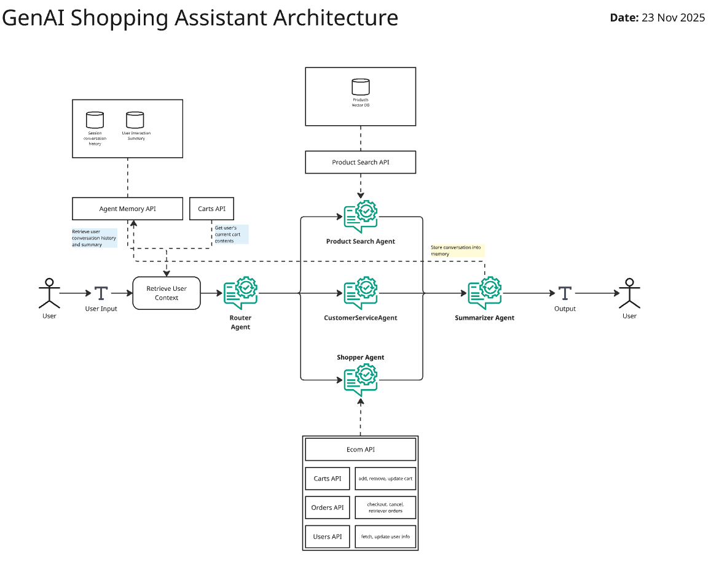

# GenAI Shopping Assistant

A shopping assistant that uses Generative AI to help users in their shopping journey on an ecom website.

## Features

**Last Updated:** 23 Nov 2025

### Specialized Agents

The user interacts with one shopping assistant - called the `RouterAgent`. This agent routes the user to the appropriate specialized agent based on the user's query:

1. `ProductSearchAgent` - This agent searches for products in the ecom website based on the user's query.
2. `ShopperAgent` - This agent helps perform shopping actions on behalf of the user: cart operations, checkout, placing, tracking and cancelling orders.
3. `CustomerServiceAgent` - This agent helps the user with general customer service queries.

### Product Search

- User's can find products using natural language queries enabled via Semantic Search
- Identification of specific user's intent when finding products such as price ranges, color, size, etc
- The products are hosted in a scalable vector DB - with both structured (product metadata) and unstructured (product descriptions) info

### Shopping Actions

- Agent can perform shopping actions based on user's query such as adding to cart, removing from cart, checking out, placing order, tracking order, cancelling order, etc

## Architecture

### GenAI Shopping Assistant Architecture

**Last Updated:** 23 Nov 2025

## Release Plan

**Last Updated:** 23 Nov 2025

| Component       | Feature                      | Capability                                                | Release |
|-----------------|------------------------------|-----------------------------------------------------------|---------|
| GenAI chatbot   | Product Search               | Basic text semantic search                                | v0.1.0  |
| GenAI chatbot   | Product Search               | Hybrid text search v1 - category                          | v0.2.0  |
| GenAI chatbot   | Product Search               | Basic image search                                        | TBD     |
| GenAI chatbot   | User Context Personalization | Within session - v1                                       | v0.1.0  |
| GenAI chatbot   | User Context Personalization | Across sessions                                           | TBD     |
| GenAI chatbot   | Agent personalization        | Specialized agents for product search, cart interaction   | v0.1.0  |
| GenAI chatbot   | Shopper Actions              | Cart interaction - v1                                     | v0.1.0  |
| GenAI chatbot   | Shopper Actions              | Cart interaction - v2                                     | v0.2.0  |
| GenAI chatbot   | Shopper Actions              | Orders interaction - v1                                   | TBD     |
| GenAI chatbot   | Guardrails                   | Input guardrails - v1                                     | v0.2.0  |
| GenAI chatbot   | Guardrails                   | Output guardrails - v1                                    | v0.2.0  |
| Ecom API        | Carts API                    | Basic interactions - add, update, empty cart              | v0.1.0  |
| Ecom API        | Users API                    | Basic operations - retrieve user info                     | v0.1.0  |
| Ecom API        | Orders API                   | Basic operations - place, cancel, retrieve orders         | TBD     |
| Ecom API        | Products API                 | Basic operations - retrieve product info                  | v0.1.0  |
| Architecture    | Microservices                | Separate microservices v1 - for Ecom API, GenAI chatbot   | v0.2.0  |
| Architecture    | Microservices                | Separate microservices v2 - for Product Search            | TBD     |
| DevOps          | Local Hosting                | Basic process to host the application locally             | TBD     |
| DevOps          | Cloud Hosting                | Basic process to host the application with cloud services | TBD     |
| DevOps          | Release Process              | Basic release process for monorepo                        | v0.1.0  |
| DevOps          | Release Process              | Separate release process for each component               | TBD     |
| DevOps          | CI Maturity                  | Linting, type checking etc                                | v0.1.0  |
| DevOps          | CI Maturity                  | Unit tests v1                                             | v0.2.0  |
| DevOps          | CI Maturity                  | Unit tests v2                                             | TBD     |
| Repo Management | MonoRepo structure           | Basic repo structure                                      | v0.1.0  |
| Repo Management | GenAI repo structure         | Basic scaffolding for prompts, model, env configs         | v0.1.0  |
| UI              | UI                           | UI                                                        | TBD     |
