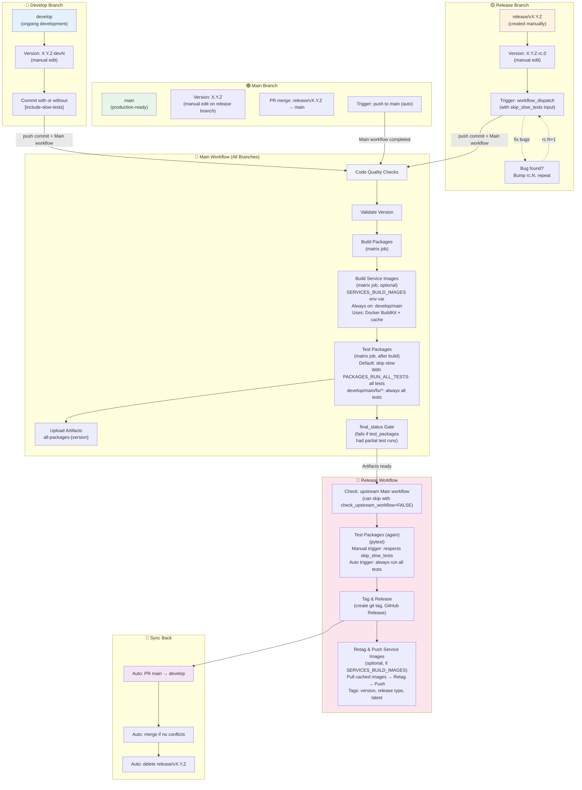

# Releasing Guide

This document describes the release workflow for the GenAI Shopping Assistant monorepo. We use a three-tier release model: **dev** → **rc** (release candidate) → **stable**.

## Table of Contents

- [Quick Overview](#quick-overview)
- [Branch Model](#branch-model)
- [Version Format](#version-format)
- [Release Types](#release-types)
  - [Dev Release](#-dev-release-from-develop)
  - [Cutting a Release Branch](#-cutting-a-release-branch)
  - [RC Release](#-rc-release-from-releasevxyz)
  - [Stable Release](#-stable-release-from-main)
  - [Post-Release Sync](#-post-release-sync-automatic)
- [CI/CD Integration](#cicd-integration)
- [Troubleshooting](#troubleshooting)
- [Validation Rules](#validation-rules)

---

## Quick Overview

```
develop branch
    ↓
Trigger: workflow_dispatch
Tag: v0.1.0-dev.1 (no GitHub release)
    ↓
    └─→ Cut release/v0.1.0 branch
            ↓
        Trigger: workflow_dispatch (per RC)
        Tag: v0.1.0-rc.0, v0.1.0-rc.1, ... (pre-release)
            ↓
        Fix bugs? → Bump rc.N, repeat
            ↓
main branch (via PR merge)
    ↓
Trigger: push to main (automatic)
Tag: v0.1.0 (stable release)
    ↓
Auto sync: PR main → develop, auto-merge, delete release branch
```

---

## Branch Model

| Branch | Purpose | Release Type | Version Format | Who Creates |
|--------|---------|--------------|----------------|-------------|
| `develop` | Ongoing development | dev | `X.Y.Z-dev.N` | team |
| `release/vX.Y.Z` | Feature freeze, stabilization | rc | `X.Y.Z-rc.N` | release engineer |
| `main` | Production-ready | stable | `X.Y.Z` | merge after RC approval |

---

## Version Bumping

To bump versions across all components (unified monorepo):

```bash
# Bump (modifies all pyproject.toml files)
project version bump --part prerelease --prerelease-prefix dev
```

**Available parts**:
- `major` - Bump X.0.0 (0.1.0 → 1.0.0)
- `minor` - Bump 0.X.0 (0.1.0 → 0.2.0)
- `patch` - Bump 0.0.X (0.1.0 → 0.1.1)
- `prerelease` - Bump pre-release version with custom identifier

**Prerelease bumping**:

Prerelease versions follow the format: `X.Y.Z-{prefix}.{id}` (e.g., `0.1.0-dev.0`, `0.1.0-rc.1`)

```bash
# Bump to next dev version (0.1.0-dev.0 → 0.1.0-dev.1)
project version bump --part prerelease --prerelease-prefix dev

# Bump to next rc version (0.1.0-rc.0 → 0.1.0-rc.1)
project version bump --part prerelease --prerelease-prefix rc

# Change from dev to rc (0.1.0-dev.5 → 0.1.0-rc.0)
project version bump --part prerelease --prerelease-prefix rc
```

**Prerelease prefix behavior**:
- Default prefix: `rc` (used if no prefix specified and no current prerelease exists)
- **Same prefix**: Increments the ID (`0.1.0-dev.0` → `0.1.0-dev.1`)
- **Different prefix**: Resets to `.0` (`0.1.0-dev.5` → `0.1.0-rc.0`)
- **No current prerelease**: Creates new prerelease with `.0` (`0.1.0` → `0.1.0-rc.0`)

**Advanced options**:

```bash
# Allow downgrading versions (disabled by default)
# Useful for reverting to earlier prerelease versions
project version bump --part prerelease --prerelease-prefix dev --allow-downgrade

# Bump only specific component (defaults to all if not specified)
project version bump --part prerelease --prerelease-prefix rc \
  --component packages/shopping-assistant
```

**After bumping**:

```bash
# Check the changes
git diff pyproject.toml*
git diff packages/*/pyproject.toml services/*/pyproject.toml

# Commit with standardized message format
OLD_VERSION="0.1.0-dev.0"
NEW_VERSION="0.1.0-dev.1"
git add pyproject.toml packages/*/pyproject.toml services/*/pyproject.toml
git commit -m "bump version: ${OLD_VERSION} -> ${NEW_VERSION}"
```

---

## Version Format

All versions follow **semantic versioning** with unified versions across all components (monorepo):

### Stable Release
```
X.Y.Z
Example: 0.1.0, 1.0.0
```
- **X**: Major (breaking changes)
- **Y**: Minor (new features)
- **Z**: Patch (bug fixes)

### Release Candidate
```
X.Y.Z-rc.N
Examples: 0.1.0-rc.0, 0.1.0-rc.1, 0.1.0-rc.2
```
- Pre-release version for testing
- N starts at 0 and increments per RC

### Dev Release
```
X.Y.Z-dev.N
Examples: 0.1.0-dev.0, 0.1.0-dev.1, 0.2.0-dev.0
```
- Development pre-release
- N starts at 0 and increments per dev release

---

## Release Types

### 1️⃣ Dev Release (from `develop`)

**When to use**: Release a development snapshot for testing/CI purposes.

**Trigger**: Manual (`workflow_dispatch`) on `develop` branch

**Steps**:

1. **Bump version using the bump script**:
   ```bash
   # Bump to next dev version (0.1.0-dev.0 → 0.1.0-dev.1)
   project version bump --part prerelease --prerelease-prefix dev
   ```

2. **Add CHANGELOG entries** (optional for dev):
   ```markdown
   ## [v0.1.0-dev.0] (YYYY-MM-DD)

   - ... changes
   ```

3. **Commit with standardized format**:
   ```bash
   git add pyproject.toml packages/*/pyproject.toml services/*/pyproject.toml CHANGELOG.md
   git commit -m "bump version: 0.1.0-dev.0 -> 0.1.0-dev.1"
   ```

4. **Trigger release workflow**:
   - Go to **Actions** → **Release** → **Run workflow**
   - Select branch: `develop`
   - Workflow will:
     - Validate version format (`X.Y.Z-dev.N`)
     - Create git tag `v0.1.0-dev.1`
     - Build and push service images (if `SERVICES_BUILD_IMAGES` enabled)
     - **NOT** create a GitHub release (dev releases are internal snapshots)

**Result**:
- ✅ Git tag: `v0.1.0-dev.1`
- ✅ GitHub Actions logs
- ❌ No GitHub Release page

---

### 2️⃣ Cutting a Release Branch

**When to use**: When features are frozen and you're ready to stabilize for release.

**Manual steps** (no automation):

1. **Ensure `develop` is up-to-date**:
   ```bash
   git checkout develop
   git pull origin develop
   ```

2. **Create release branch**:
   ```bash
   git checkout -b release/v0.1.0
   git push origin release/v0.1.0
   ```

3. **Bump version to RC0 using the script**:
   ```bash
   # Bump to rc.0 (0.1.0-dev.5 → 0.1.0-rc.0)
   project version bump --part prerelease --prerelease-prefix rc
   ```

4. **Update CHANGELOG**:
   ```markdown
   ## [v0.1.0-rc.0] (YYYY-MM-DD)

   ### First Release Candidate
   - ... feature list
   ```

5. **Commit and push with standardized format**:
   ```bash
   git add pyproject.toml packages/*/pyproject.toml services/*/pyproject.toml CHANGELOG.md
   git commit -m "bump version: 0.1.0-dev.5 -> 0.1.0-rc.0"
   git push origin release/v0.1.0
   ```

6. **Proceed to RC Release** (next section)

---

### 3️⃣ RC Release (from `release/vX.Y.Z`)

**When to use**: Test a release candidate; iterate if bugs are found.

**Trigger**: Manual (`workflow_dispatch`) on `release/vX.Y.Z` branch

**Steps**:

1. **Ensure you're on the release branch**:
   ```bash
   git checkout release/v0.1.0
   git pull origin release/v0.1.0
   ```

2. **Version must match branch** (validation enforced):
   - Branch: `release/v0.1.0` → Version in pyproject.toml: `0.1.0-rc.0`, `0.1.0-rc.1`, etc.
   - ⚠️ Version mismatch will fail validation

3. **Trigger release workflow**:
   - Go to **Actions** → **Release** → **Run workflow**
   - Select branch: `release/v0.1.0`
   - **Workflow inputs**:
     - `check_upstream_workflow`: Check if main workflow passed (default: `TRUE`)
       - Set to `FALSE` if you want to skip this check (e.g., for RC releases while slow tests are being skipped)
     - `skip_slow_tests`: Skip slow tests during release testing (default: `FALSE`)
       - Set to `TRUE` to run only quick tests
       - Set to `FALSE` to run all tests including slow ones
   - Workflow will:
     - Validate version format (`X.Y.Z-rc.N`)
     - Validate base version matches branch (`0.1.0`)
     - Validate CHANGELOG entry for `[v0.1.0-rc.N]` exists
     - Download built packages from upstream Main workflow
     - Run tests on built packages (respecting `skip_slow_tests` parameter)
     - Create git tag `v0.1.0-rc.0`
     - Create GitHub Release (marked as **pre-release**)
     - Build and push service images tagged with RC version (if `SERVICES_BUILD_IMAGES` enabled)

**If bugs found**:

1. **Fix on release branch**:
   ```bash
   # ... make fixes ...
   git add <files>
   git commit -m "fix: <issue>"
   git push origin release/v0.1.0
   ```

2. **Bump RC version using the script**:
   ```bash
   # Bump to next RC (0.1.0-rc.1 → 0.1.0-rc.2)
   project version bump --part prerelease --prerelease-prefix rc
   ```

3. **Update CHANGELOG with new [v0.1.0-rc.1] entry**:
   ```markdown
   ## [v0.1.0-rc.1] (YYYY-MM-DD)

   ### Release Candidate 1
   - Bug fixes from rc.0
   ```

4. **Commit and push with standardized format**:
   ```bash
   git add pyproject.toml packages/*/pyproject.toml services/*/pyproject.toml CHANGELOG.md
   git commit -m "bump version: 0.1.0-rc.0 -> 0.1.0-rc.1"
   git push origin release/v0.1.0
   ```

5. **Trigger workflow again** for `v0.1.0-rc.1`

**Result**:
- ✅ Git tags: `v0.1.0-rc.0`, `v0.1.0-rc.1`, etc.
- ✅ GitHub Releases (pre-release badge)
- ✅ Release notes extracted from CHANGELOG

---

### 4️⃣ Stable Release (from `main`)

**When to use**: After RC approval, release to production.

**Prerequisites**:
- RC is approved (no more bugs found)
- Release branch: `release/v0.1.0`
- Latest RC tag: `v0.1.0-rc.N`

**Manual steps**:

1. **Remove RC suffix from version** (`0.1.0-rc.N` → `0.1.0`):
   ```bash
   git checkout release/v0.1.0
   git pull origin release/v0.1.0

   # Option A: Manual edit (simplest for final release)
   # Edit all pyproject.toml files: 0.1.0-rc.N → 0.1.0

   # Option B: Use bump script with major/minor/patch
   # (This converts the pre-release version to stable)
   # After manual edits or script:
   ```

2. **Update CHANGELOG**:
   ```markdown
   # Remove (TBD) if present, add release date
   ## [v0.1.0] (2026-03-03)

   ### Stable Release
   - ... release notes
   ```

3. **Commit on release branch with standardized format**:
   ```bash
   git add pyproject.toml packages/*/pyproject.toml services/*/pyproject.toml CHANGELOG.md
   git commit -m "bump version: 0.1.0-rc.N -> 0.1.0"
   git push origin release/v0.1.0
   ```

4. **Create PR**: `release/v0.1.0` → `main`
   ```bash
   # Via GitHub UI:
   # 1. Go to repository
   # 2. Pull Requests → New Pull Request
   # 3. Base: main, Compare: release/v0.1.0
   # 4. Create PR
   # 5. Review and merge (squash and merge commit)
   ```

5. **Merge PR to `main`**:
   - Ensure all checks pass
   - Merge with **Squash and merge commit**

6. **CI triggers automatically**:
   - Workflow detects push to `main`
   - Validates version: `X.Y.Z` (no pre-release suffix)
   - Validates CHANGELOG entry: `[v0.1.0]`
   - Creates git tag: `v0.1.0`
   - Creates GitHub Release (stable)
   - Builds and pushes service images tagged with stable version and `latest` (if `SERVICES_BUILD_IMAGES` enabled)

**Result**:
- ✅ Git tag: `v0.1.0`
- ✅ GitHub Release (stable, with release notes)
- ✅ Auto-triggers sync job (see below)

---

### 5️⃣ Post-Release Sync (Automatic)

**When**: Automatically triggered after stable release on `main`

**What happens**:

1. **Auto creates PR**: `main` → `develop`
   - Title: `chore: sync main → develop after v0.1.0 stable release`
   - Body: Auto-generated

2. **Auto-merges PR** (if no conflicts):
   - Merge strategy: **normal merge commit** (not rebase, not squash)
   - If conflicts exist: PR remains open for manual resolution

3. **Deletes release branch**:
   - Deletes `release/v0.1.0`
   - Keeps `main` and `develop` branches

**Manual action if needed**:
```bash
# If auto-merge failed due to conflicts
git checkout develop
git pull origin develop
# ... resolve conflicts ...
git add <files>
git commit -m "chore: resolve release sync conflicts"
git push origin develop

# After manual sync, manually delete release branch
git push origin --delete release/v0.1.0
```

---

## CI/CD Integration

### Workflow: `.github/workflows/main.yml` (Package Builds, Service Images & Testing)

**Jobs**:

| Job | Trigger | Purpose |
|-----|---------|---------|
| `run_checks` | all branches | Code quality checks (linting, formatting, security) |
| `validate_version` | all branches | Version validation and consistency checks |
| `build_packages` | all branches (matrix) | Build packages (wheels, sdists) for each component |
| `build_services` | all branches (conditional) | Build service container images with Docker BuildKit (matrix job, optional) |
| `test_packages` | all branches (after build) | Test built packages against the wheel artifact |
| `upload_packages` | all branches | Collect and upload all package artifacts |
| `final_status` | all branches | Gate: Fails if test_packages had failures (blocks PRs if slow tests skipped) |

**Service Image Builds in `build_services` Job**:
- Builds Docker container images for services using Docker BuildKit
- **Conditional**: Controlled via environment variable `SERVICES_BUILD_IMAGES`
  - Always enabled on `develop` and `main` branches
  - Optional on feature branches (disabled by default)
- **Build features**:
  - Docker BuildKit support with inline cache (`BUILDKIT_INLINE_CACHE=1`)
  - Cache layers tagged with `{branch_slug}-latest`
  - Images tagged with `{REGISTRY}/{service}:{IMAGE_TAG}`
  - Environment: Uses `.env.ci` for build configuration
- **Matrix job**: Builds images for each service in the monorepo
- Images are cached and reused in downstream release workflows

**Testing in `test_packages` Job**:
- Runs after packages are built
- Downloads built wheel artifact and tests against it (not editable install)
- **By default**: Runs `pytest -m "not slow"` (excludes slow tests)
- **With `PACKAGES_RUN_ALL_TESTS` env var**: Runs all tests including slow ones
  - Set environment variable before pushing: `export PACKAGES_RUN_ALL_TESTS=true`
  - Also enabled by default on `develop`, `main`, and `fix/develop-ci-tests-bug` branches
- Tests are run in a dedicated test venv (`.venv-test`)
- **Fails if partial tests are run**: The job exits with code 1 if slow tests are skipped (PARTIAL), blocking the PR

**Slow Test Marker**:
Tests marked with `@pytest.mark.slow` are skipped on most branches by default, but included in:
- Main workflow on `develop`, `main`, and `fix/develop-ci-tests-bug` branches (always run all tests)
- Release workflow (manual RC releases with `skip_slow_tests=FALSE`)
- Release workflow (automated stable releases)

**Artifacts Uploaded**:
- Individual: `{package-name}-{version}` (per package)
- Aggregated: `all-packages-{version}` (all packages combined)

These artifacts are available for download in downstream workflows.

### Workflow: `.github/workflows/release.yml` (Release & Publishing)

**Jobs**:

| Job | Trigger | Purpose |
|-----|---------|---------|
| `check_upstream_workflow` | workflow_run (main) or workflow_dispatch | Verify upstream Main workflow succeeded, fetch run ID |
| `setup` | all | Determine release type, validate version format |
| `validate` | all | Check tag uniqueness, version ordering, CHANGELOG |
| `test_packages` | all | Download built packages from upstream and run tests again |
| `tag_and_release` | all | Download packages from upstream, create git tag, GitHub Release |
| `retag_and_push_service_images` | all (conditional) | Pull service images from cache, retag with version/release tag, push to registry |
| `sync_back` | stable only | Auto PR main→develop, auto-merge, delete release branch |

**Testing in `test_packages` Job**:
- Downloads built packages from upstream Main workflow
- Re-runs tests against the built wheel (same as Main workflow)
- **For manual release (workflow_dispatch)**:
  - Respects `skip_slow_tests` input parameter (defaults to `FALSE`)
  - If `skip_slow_tests=TRUE`: Runs `pytest -m "not slow"`
  - If `skip_slow_tests=FALSE`: Runs all tests including slow ones (respects `PACKAGES_RUN_ALL_TESTS` if set)
- **For automated stable release (push to main)**:
  - Always runs all tests including slow ones (no skipping)

**Service Image Retag & Push in `retag_and_push_service_images` Job**:
- Pulls service images cached from Main workflow build
- Retagged with version and release tags (e.g., `v0.1.0`, `latest` for stable)
- **For dev releases**: Retagged with commit SHA and branch slug
- **For RC releases**: Retagged with RC version tag
- **For stable releases**: Retagged with stable version tag
- Pushed to container registry specified in `.env.ci`
- Docker login required (from GitHub Secrets)
- **Conditional**: Only runs if `SERVICES_BUILD_IMAGES` is enabled

**Package Artifact Download**:
- Downloads `all-packages-{version}` from upstream workflow run
- Uses `run-id` from `check_upstream_workflow` job to identify the source workflow run
- Packages attached to GitHub Release (RC and stable releases only)

**Check Upstream Workflow**:
- By default, checks that the Main workflow succeeded before proceeding with release
- Can be skipped with `check_upstream_workflow=FALSE` for manual RC releases
  - Useful when: doing RC releases while slow tests are being skipped in main workflow
- Ensures both package builds and service image builds are complete (if enabled)

### Package Build & Artifact Flow

**When package builds happen**:
1. **On every push to any branch** (not just releases):
   - Main workflow (`main.yml`) runs automatically
   - `build_packages` job builds wheel and source distributions for each package
   - Each package artifact named: `{package-name}-{version}`
   - Aggregated artifact named: `all-packages-{version}`

2. **During release workflow** (`release.yml`):
   - Release workflow waits for Main workflow to complete successfully
   - Downloads the pre-built `all-packages-{version}` artifact
   - Uses `run-id` to fetch from the correct upstream workflow run
   - Attaches packages to GitHub Release (for RC and stable only)

**Build Matrix**:
Packages are built as a matrix job for each component:
- `packages/shopping-assistant`
- Other packages as added to the monorepo

Each build produces both wheel (`.whl`) and source (`.tar.gz`) distributions.

### Version Extraction

Version is read from root `pyproject.toml`:
```toml
[project]
version = "0.1.0"  # ← This is the source of truth
```

**All components must have the same version** (unified releases).

### CHANGELOG Validation

For RC and stable releases, CHANGELOG must have an entry:

```markdown
# ✅ Valid
## [v0.1.0-rc0] (...)
## [v0.1.0] (...)

# ❌ Invalid (missing brackets)
## v0.1.0 (...)
```

Format: `## [vX.Y.Z...]` with **square brackets**.

### Version Comparison

Uses semver semantics via `semver` library:
- `0.1.0 > 0.1.0-rc1 > 0.1.0-rc0 > 0.1.0-dev1`
- New version must be strictly greater than all existing tags

---

## Slow Tests & CI/CD Testing Strategy

### Default Behavior: Fast Tests Only

By default, on every push to any branch:
- Main workflow runs only **fast tests** (excludes tests marked with `@pytest.mark.slow`)
- This keeps CI/CD feedback loops fast (~minutes)
- Slow tests are skipped in both Main and Release workflows

### Running All Tests (Including Slow)

To run all tests including slow ones on a push, set the `PACKAGES_RUN_ALL_TESTS` environment variable.
**What happens**:
- Main workflow detects `PACKAGES_RUN_ALL_TESTS=true` and runs `pytest` (no filter)
- All tests including slow ones are executed
- `final_status` gate passes (because all tests were run)

### Test Execution in Release Workflow

**For RC releases (manual trigger)**:
- Controlled via `skip_slow_tests` input (default: `FALSE`)
- `FALSE`: Runs all tests
- `TRUE`: Runs fast tests only

**For stable releases (automated, push to main)**:
- Always runs all tests (no skipping)
- Ensures production releases are thoroughly tested

### Marking Tests as Slow

In your test files, mark slow tests:

```python
import pytest

@pytest.mark.slow
def test_long_running_operation():
    # This test will be skipped on regular pushes
    # Only runs with [include-slow-tests] or in release workflows
    pass
```

---

## Troubleshooting

### Q: Workflow failed with "Tag already exists"
**A**: The tag was already created (probably from a retry).
- Check `git tag` to confirm
- Delete local: `git tag -d v0.1.0`
- Delete remote: `git push origin --delete v0.1.0`
- Re-run workflow

### Q: CHANGELOG validation failed
**A**: Entry format is wrong.
- Must use: `## [v0.1.0]` (with square brackets)
- Check CHANGELOG.md for typos
- See [CHANGELOG Validation](#changelog-validation)

### Q: Version comparison failed
**A**: New version is not greater than latest tag.
- Check `git tag -l | sort -V | tail -1` (latest tag)
- Ensure new version in `pyproject.toml` is higher
- Example: If latest is `v0.1.0-dev.5`, next must be `v0.1.0-dev.6` or `v0.1.0-rc.0` or higher

### Q: RC branch validation failed
**A**: Version base doesn't match branch name.
- Branch: `release/v0.1.0` (branch name: `0.1.0`)
- Version: `0.1.0-rc0` (base: `0.1.0`)
- ✅ Match: `release/v0.1.0` + `0.1.0-rcN` → OK
- ❌ Mismatch: `release/v0.1.0` + `0.2.0-rc0` → FAIL

### Q: Auto-sync PR can't auto-merge (conflicts)
**A**: `develop` and `main` have diverged (unusual).
- Manual merge required:
  ```bash
  git checkout develop
  git pull origin develop
  git merge main
  # ... resolve conflicts ...
  git push origin develop
  ```
- Then manually delete release branch: `git push origin --delete release/vX.Y.Z`

### Q: Which file do I edit to bump version?
**A**: All `pyproject.toml` files in the monorepo:
- Root: `./pyproject.toml`
- Packages: `packages/shopping-assistant/pyproject.toml`
- Services: `services/shopping-assistant/pyproject.toml`, `services/ecom-backend/pyproject.toml`

All must have the **same version** (unified releasing).

### Q: Package artifacts not found in release workflow
**A**: The Main workflow must complete successfully before Release workflow runs.
- Check that Main workflow (`main.yml`) passed on the commit
- If Main workflow failed, Release workflow cannot download artifacts
- Artifacts are named: `all-packages-{version}` where version matches `pyproject.toml`
- Re-trigger Release workflow after Main workflow succeeds

### Q: How do I get the built packages?
**A**: Packages are built and uploaded as GitHub artifacts:
1. **During development**: Check workflow run artifacts in Actions tab
   - Individual: `{package-name}-{version}`
   - Combined: `all-packages-{version}`
2. **On release**: Packages attached to the GitHub Release page
   - Go to Releases → latest release
   - Download `.whl` and `.tar.gz` files

### Q: PR is blocked — "One or more jobs failed or were cancelled"
**A**: The `final_status` job failed because `test_packages` ran with only partial tests (slow tests skipped).
- This ensures all changes are thoroughly tested before merging to main
- **Solution**: Set `PACKAGES_RUN_ALL_TESTS` environment variable and re-push
  ```bash
  export PACKAGES_RUN_ALL_TESTS=true
  git push origin <branch>
  ```
- Or if you're on `develop`, `main`, or `fix/develop-ci-tests-bug`, the tests should run automatically (all tests included)

### Q: Release workflow failed — "Upstream workflow status: failure"
**A**: The Main workflow must pass before the Release workflow can proceed.
- Check the Main workflow run for failed jobs
- Fix any failing tests or checks
- Re-run the Main workflow or re-trigger the Release workflow after Main passes

### Q: How do I skip slow tests in an RC release?
**A**: When manually triggering the Release workflow:
1. Go to **Actions** → **Release** → **Run workflow**
2. Set `skip_slow_tests` to `TRUE`
3. This will run only fast tests on the RC packages
4. Useful when: doing quick RC releases for testing

### Q: Can I skip the upstream workflow check in Release workflow?
**A**: Yes, for manual RC releases:
1. Go to **Actions** → **Release** → **Run workflow**
2. Set `check_upstream_workflow` to `FALSE`
3. The release workflow will proceed without waiting for Main workflow
4. **Warning**: Ensure Main workflow passed before proceeding
5. Useful when: doing RC releases while slow tests are being skipped in main workflow

---

## Validation Rules

The workflow enforces these rules (cannot be bypassed):

### All Release Types
- ✅ New tag must be **greater than** all existing tags (global, semver ordering)
- ✅ No duplicate tags allowed
- ✅ Version in `pyproject.toml` must match the release type

### Dev Release (`develop` branch)
- ✅ Branch must be exactly `develop`
- ✅ Version format: `X.Y.Z-dev.N`

### RC Release (`release/vX.Y.Z` branch)
- ✅ Branch must match `release/v*`
- ✅ Version format: `X.Y.Z-rc.N`
- ✅ Base version (`X.Y.Z`) must match branch version
- ✅ CHANGELOG entry required: `[v0.1.0-rc.N]`

### Stable Release (`main` branch)
- ✅ Branch must be exactly `main`
- ✅ Version format: `X.Y.Z` (no pre-release suffix)
- ✅ CHANGELOG entry required: `[v0.1.0]`

---

## Release Flow Diagram



---

## Summary

| Phase | Branch | Version | Trigger | GitHub Release | Service Images |
|-------|--------|---------|---------|-----------------|---|
| Development | `develop` | `X.Y.Z-dev.N` | Manual | ❌ No | ✅ Build & Push (with ENV) |
| Stabilization | `release/vX.Y.Z` | `X.Y.Z-rc.N` | Manual | ✅ Pre-release | ✅ Build & Push RC (with ENV) |
| Production | `main` | `X.Y.Z` | Auto (push) | ✅ Stable | ✅ Build & Push stable + latest (with ENV) |
| Sync | (auto) | (auto) | Auto | (auto) | (auto) |

For questions or issues, refer to [Troubleshooting](#troubleshooting) or check `.github/workflows/release.yml` for implementation details.
