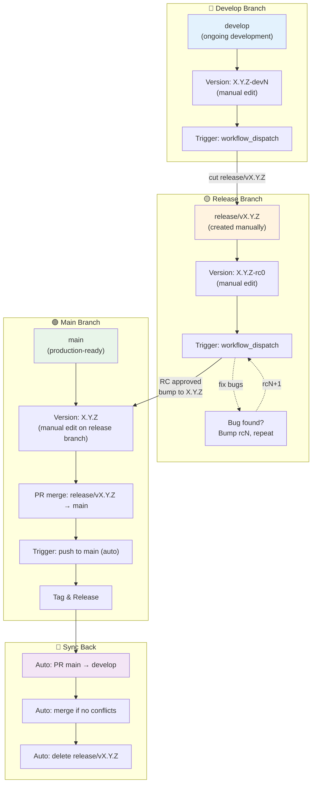

# Releasing Guide

This document describes the release workflow for the GenAI Shopping Assistant monorepo. We use a three-tier release model: **dev** → **rc** (release candidate) → **stable**.

## Table of Contents

- [Quick Overview](#quick-overview)
- [Branch Model](#branch-model)
- [Version Format](#version-format)
- [Release Types](#release-types)
  - [Dev Release](#-dev-release-from-develop)
  - [Cutting a Release Branch](#-cutting-a-release-branch)
  - [RC Release](#-rc-release-from-releasevxyz)
  - [Stable Release](#-stable-release-from-main)
  - [Post-Release Sync](#-post-release-sync-automatic)
- [CI/CD Integration](#cicd-integration)
- [Troubleshooting](#troubleshooting)
- [Validation Rules](#validation-rules)

---

## Quick Overview

```
develop branch
    ↓
Trigger: workflow_dispatch
Tag: v0.1.0-dev1 (no GitHub release)
    ↓
    └─→ Cut release/v0.1.0 branch
            ↓
        Trigger: workflow_dispatch (per RC)
        Tag: v0.1.0-rc0, v0.1.0-rc1, ... (pre-release)
            ↓
        Fix bugs? → Bump rcN, repeat
            ↓
main branch (via PR merge)
    ↓
Trigger: push to main (automatic)
Tag: v0.1.0 (stable release)
    ↓
Auto sync: PR main → develop, auto-merge, delete release branch
```

---

## Branch Model

| Branch | Purpose | Release Type | Version Format | Who Creates |
|--------|---------|--------------|----------------|-------------|
| `develop` | Ongoing development | dev | `X.Y.Z-devN` | team |
| `release/vX.Y.Z` | Feature freeze, stabilization | rc | `X.Y.Z-rcN` | release engineer |
| `main` | Production-ready | stable | `X.Y.Z` | merge after RC approval |

---

## Version Bumping

To bump versions across all components (unified monorepo), use the **`scripts/ci/bump_version.py`** script:

```bash
# Dry run (shows what would change, doesn't modify files)
python3 scripts/ci/bump_version.py \
  --repo-root . \
  --part prerelease \
  --prerelease dev

# Actual bump (modifies all pyproject.toml files)
python3 scripts/ci/bump_version.py \
  --repo-root . \
  --part prerelease \
  --prerelease dev
```

**Available parts**:
- `major` - Bump X.0.0 (0.1.0 → 1.0.0)
- `minor` - Bump 0.X.0 (0.1.0 → 0.2.0)
- `patch` - Bump 0.0.X (0.1.0 → 0.1.1)
- `prerelease` - Bump pre-release version with custom identifier
  - `--prerelease dev` → `0.1.0-dev0`, `0.1.0-dev1`, etc.
  - `--prerelease rc` → `0.1.0-rc1`, `0.1.0-rc2`, etc. (default)

**After bumping**:

```bash
# Check the changes
git diff pyproject.toml*
git diff packages/*/pyproject.toml services/*/pyproject.toml

# Commit with standardized message format
OLD_VERSION="0.1.0-dev1"
NEW_VERSION="0.1.0-dev2"
git add pyproject.toml packages/*/pyproject.toml services/*/pyproject.toml
git commit -m "bump version: ${OLD_VERSION} -> ${NEW_VERSION}"
```

---

## Version Format

All versions follow **semantic versioning** with unified versions across all components (monorepo):

### Stable Release
```
X.Y.Z
Example: 0.1.0, 1.0.0
```
- **X**: Major (breaking changes)
- **Y**: Minor (new features)
- **Z**: Patch (bug fixes)

### Release Candidate
```
X.Y.Z-rcN
Examples: 0.1.0-rc0, 0.1.0-rc1, 0.1.0-rc2
```
- Pre-release version for testing
- N starts at 0 and increments per RC

### Dev Release
```
X.Y.Z-devN
Examples: 0.1.0-dev1, 0.1.0-dev2, 0.2.0-dev0
```
- Development pre-release
- N starts at 1 and increments per dev release

---

## Release Types

### 1️⃣ Dev Release (from `develop`)

**When to use**: Release a development snapshot for testing/CI purposes.

**Trigger**: Manual (`workflow_dispatch`) on `develop` branch

**Steps**:

1. **Bump version using the bump script**:
   ```bash
   # Bump to next dev version (0.1.0-dev1 → 0.1.0-dev2)
   python3 scripts/ci/bump_version.py \
     --repo-root . \
     --part prerelease \
     --prerelease dev
   ```

2. **Add CHANGELOG entries** (optional for dev):
   ```markdown
   ## [v0.1.0-dev1] (YYYY-MM-DD)

   - ... changes
   ```

3. **Commit with standardized format**:
   ```bash
   git add pyproject.toml packages/*/pyproject.toml services/*/pyproject.toml CHANGELOG.md
   git commit -m "bump version: 0.1.0-dev1 -> 0.1.0-dev2"
   ```

4. **Trigger release workflow**:
   - Go to **Actions** → **Release** → **Run workflow**
   - Select branch: `develop`
   - Workflow will:
     - Validate version format (`X.Y.Z-devN`)
     - Create git tag `v0.1.0-dev1`
     - **NOT** create a GitHub release (dev releases are internal snapshots)

**Result**:
- ✅ Git tag: `v0.1.0-dev1`
- ✅ GitHub Actions logs
- ❌ No GitHub Release page

---

### 2️⃣ Cutting a Release Branch

**When to use**: When features are frozen and you're ready to stabilize for release.

**Manual steps** (no automation):

1. **Ensure `develop` is up-to-date**:
   ```bash
   git checkout develop
   git pull origin develop
   ```

2. **Create release branch**:
   ```bash
   git checkout -b release/v0.1.0
   git push origin release/v0.1.0
   ```

3. **Bump version to RC0 using the script**:
   ```bash
   # Bump to rc0 (0.1.0-dev5 → 0.1.0-rc0)
   python3 scripts/ci/bump_version.py \
     --repo-root . \
     --part prerelease \
     --prerelease rc
   ```

4. **Update CHANGELOG**:
   ```markdown
   ## [v0.1.0-rc0] (YYYY-MM-DD)

   ### First Release Candidate
   - ... feature list
   ```

5. **Commit and push with standardized format**:
   ```bash
   git add pyproject.toml packages/*/pyproject.toml services/*/pyproject.toml CHANGELOG.md
   git commit -m "bump version: 0.1.0-dev5 -> 0.1.0-rc0"
   git push origin release/v0.1.0
   ```

6. **Proceed to RC Release** (next section)

---

### 3️⃣ RC Release (from `release/vX.Y.Z`)

**When to use**: Test a release candidate; iterate if bugs are found.

**Trigger**: Manual (`workflow_dispatch`) on `release/vX.Y.Z` branch

**Steps**:

1. **Ensure you're on the release branch**:
   ```bash
   git checkout release/v0.1.0
   git pull origin release/v0.1.0
   ```

2. **Version must match branch** (validation enforced):
   - Branch: `release/v0.1.0` → Version in pyproject.toml: `0.1.0-rc0`, `0.1.0-rc1`, etc.
   - ⚠️ Version mismatch will fail validation

3. **Trigger release workflow**:
   - Go to **Actions** → **Release** → **Run workflow**
   - Select branch: `release/v0.1.0`
   - Workflow will:
     - Validate version format (`X.Y.Z-rcN`)
     - Validate base version matches branch (`0.1.0`)
     - Validate CHANGELOG entry for `[v0.1.0-rcN]` exists
     - Create git tag `v0.1.0-rc0`
     - Create GitHub Release (marked as **pre-release**)

**If bugs found**:

1. **Fix on release branch**:
   ```bash
   # ... make fixes ...
   git add <files>
   git commit -m "fix: <issue>"
   git push origin release/v0.1.0
   ```

2. **Bump RC version using the script**:
   ```bash
   # Bump to next RC (0.1.0-rc0 → 0.1.0-rc1)
   python3 scripts/ci/bump_version.py \
     --repo-root . \
     --part prerelease \
     --prerelease rc
   ```

3. **Update CHANGELOG with new [v0.1.0-rc1] entry**:
   ```markdown
   ## [v0.1.0-rc1] (YYYY-MM-DD)

   ### Release Candidate 1
   - Bug fixes from rc0
   ```

4. **Commit and push with standardized format**:
   ```bash
   git add pyproject.toml packages/*/pyproject.toml services/*/pyproject.toml CHANGELOG.md
   git commit -m "bump version: 0.1.0-rc0 -> 0.1.0-rc1"
   git push origin release/v0.1.0
   ```

5. **Trigger workflow again** for `v0.1.0-rc1`

**Result**:
- ✅ Git tags: `v0.1.0-rc0`, `v0.1.0-rc1`, etc.
- ✅ GitHub Releases (pre-release badge)
- ✅ Release notes extracted from CHANGELOG

---

### 4️⃣ Stable Release (from `main`)

**When to use**: After RC approval, release to production.

**Prerequisites**:
- RC is approved (no more bugs found)
- Release branch: `release/v0.1.0`
- Latest RC tag: `v0.1.0-rcN`

**Manual steps**:

1. **Remove RC suffix from version** (0.1.0-rcN → 0.1.0):
   ```bash
   git checkout release/v0.1.0
   git pull origin release/v0.1.0

   # Option A: Manual edit (simplest for final release)
   # Edit all pyproject.toml files: 0.1.0-rc2 → 0.1.0

   # Option B: Use bump script to finalize
   # (This converts the pre-release version to stable)
   # After manual edits or script:
   ```

2. **Update CHANGELOG**:
   ```markdown
   # Remove (TBD) if present, add release date
   ## [v0.1.0] (2026-03-03)

   ### Stable Release
   - ... release notes
   ```

3. **Commit on release branch with standardized format**:
   ```bash
   git add pyproject.toml packages/*/pyproject.toml services/*/pyproject.toml CHANGELOG.md
   git commit -m "bump version: 0.1.0-rc2 -> 0.1.0"
   git push origin release/v0.1.0
   ```

4. **Create PR**: `release/v0.1.0` → `main`
   ```bash
   # Via GitHub UI:
   # 1. Go to repository
   # 2. Pull Requests → New Pull Request
   # 3. Base: main, Compare: release/v0.1.0
   # 4. Create PR
   # 5. Review and merge (normal merge commit, NOT squash/rebase)
   ```

5. **Merge PR to `main`**:
   - Ensure all checks pass
   - Merge with **Create a merge commit** (default)

6. **CI triggers automatically**:
   - Workflow detects push to `main`
   - Validates version: `X.Y.Z` (no pre-release suffix)
   - Validates CHANGELOG entry: `[v0.1.0]`
   - Creates git tag: `v0.1.0`
   - Creates GitHub Release (stable)

**Result**:
- ✅ Git tag: `v0.1.0`
- ✅ GitHub Release (stable, with release notes)
- ✅ Auto-triggers sync job (see below)

---

### 5️⃣ Post-Release Sync (Automatic)

**When**: Automatically triggered after stable release on `main`

**What happens**:

1. **Auto creates PR**: `main` → `develop`
   - Title: `chore: sync main → develop after v0.1.0 stable release`
   - Body: Auto-generated

2. **Auto-merges PR** (if no conflicts):
   - Merge strategy: **normal merge commit** (not rebase, not squash)
   - If conflicts exist: PR remains open for manual resolution

3. **Deletes release branch**:
   - Deletes `release/v0.1.0`
   - Keeps `main` and `develop` branches

**Manual action if needed**:
```bash
# If auto-merge failed due to conflicts
git checkout develop
git pull origin develop
# ... resolve conflicts ...
git add <files>
git commit -m "chore: resolve release sync conflicts"
git push origin develop

# After manual sync, manually delete release branch
git push origin --delete release/v0.1.0
```

---

## CI/CD Integration

### Workflow: `.github/workflows/release.yml`

**Jobs**:

| Job | Trigger | Purpose |
|-----|---------|---------|
| `setup` | all | Determine release type, validate version format |
| `validate` | all | Check tag uniqueness, version ordering, CHANGELOG |
| `run_tests` | all | Run test suite (placeholder) |
| `tag_and_release` | all | Create git tag, GitHub Release (if applicable) |
| `sync_back` | stable only | Auto PR main→develop, auto-merge, delete release branch |

### Version Extraction

Version is read from root `pyproject.toml`:
```toml
[project]
version = "0.1.0"  # ← This is the source of truth
```

**All components must have the same version** (unified releases).

### CHANGELOG Validation

For RC and stable releases, CHANGELOG must have an entry:

```markdown
# ✅ Valid
## [v0.1.0-rc0] (...)
## [v0.1.0] (...)

# ❌ Invalid (missing brackets)
## v0.1.0 (...)
```

Format: `## [vX.Y.Z...]` with **square brackets**.

### Version Comparison

Uses semver semantics via `semver` library:
- `0.1.0 > 0.1.0-rc1 > 0.1.0-rc0 > 0.1.0-dev1`
- New version must be strictly greater than all existing tags

---

## Troubleshooting

### Q: Workflow failed with "Tag already exists"
**A**: The tag was already created (probably from a retry).
- Check `git tag` to confirm
- Delete local: `git tag -d v0.1.0`
- Delete remote: `git push origin --delete v0.1.0`
- Re-run workflow

### Q: CHANGELOG validation failed
**A**: Entry format is wrong.
- Must use: `## [v0.1.0]` (with square brackets)
- Check CHANGELOG.md for typos
- See [CHANGELOG Validation](#changelog-validation)

### Q: Version comparison failed
**A**: New version is not greater than latest tag.
- Check `git tag -l | sort -V | tail -1` (latest tag)
- Ensure new version in `pyproject.toml` is higher
- Example: If latest is `v0.1.0-dev5`, next must be `v0.1.0-dev6` or `v0.1.0-rc0` or higher

### Q: RC branch validation failed
**A**: Version base doesn't match branch name.
- Branch: `release/v0.1.0` (branch name: `0.1.0`)
- Version: `0.1.0-rc0` (base: `0.1.0`)
- ✅ Match: `release/v0.1.0` + `0.1.0-rcN` → OK
- ❌ Mismatch: `release/v0.1.0` + `0.2.0-rc0` → FAIL

### Q: Auto-sync PR can't auto-merge (conflicts)
**A**: `develop` and `main` have diverged (unusual).
- Manual merge required:
  ```bash
  git checkout develop
  git pull origin develop
  git merge main
  # ... resolve conflicts ...
  git push origin develop
  ```
- Then manually delete release branch: `git push origin --delete release/vX.Y.Z`

### Q: Which file do I edit to bump version?
**A**: All `pyproject.toml` files in the monorepo:
- Root: `./pyproject.toml`
- Packages: `packages/shopping-assistant/pyproject.toml`
- Services: `services/shopping-assistant/pyproject.toml`, `services/ecom-backend/pyproject.toml`

All must have the **same version** (unified releasing).

---

## Validation Rules

The workflow enforces these rules (cannot be bypassed):

### All Release Types
- ✅ New tag must be **greater than** all existing tags (global, semver ordering)
- ✅ No duplicate tags allowed
- ✅ Version in `pyproject.toml` must match the release type

### Dev Release (`develop` branch)
- ✅ Branch must be exactly `develop`
- ✅ Version format: `X.Y.Z-devN`

### RC Release (`release/vX.Y.Z` branch)
- ✅ Branch must match `release/v*`
- ✅ Version format: `X.Y.Z-rcN`
- ✅ Base version (`X.Y.Z`) must match branch version
- ✅ CHANGELOG entry required: `[v0.1.0-rcN]`

### Stable Release (`main` branch)
- ✅ Branch must be exactly `main`
- ✅ Version format: `X.Y.Z` (no pre-release suffix)
- ✅ CHANGELOG entry required: `[v0.1.0]`

---

## Release Flow Diagram



---

## Summary

| Phase | Branch | Version | Trigger | GitHub Release |
|-------|--------|---------|---------|-----------------|
| Development | `develop` | `X.Y.Z-devN` | Manual | ❌ No |
| Stabilization | `release/vX.Y.Z` | `X.Y.Z-rcN` | Manual | ✅ Pre-release |
| Production | `main` | `X.Y.Z` | Auto (push) | ✅ Stable |
| Sync | (auto) | (auto) | Auto | (auto) |

For questions or issues, refer to [Troubleshooting](#troubleshooting) or check `.github/workflows/release.yml` for implementation details.
