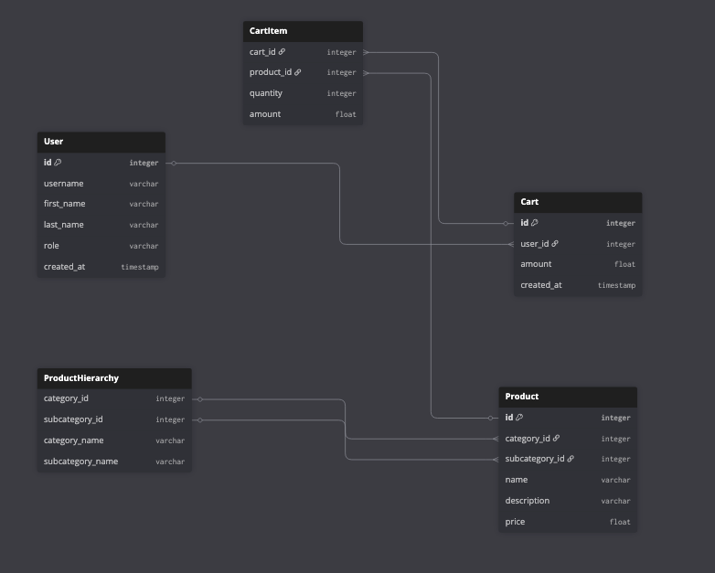

# Ecom Backend Service

## Repo structure


```
.
├── core/
│   ├── config.py
│   ├── database.py
│   ├── logging.py
│   └── security.py
│
├── domains/
│   ├── users/
│   │   ├── models/
│   │   │   └── user.py
│   │   ├── repository.py
│   │   ├── service.py
│   │   ├── api/
│   │   │   └── router.py
│   │   ├── migrations/
│   │   │   ├── env.py
│   │   │   ├── alembic.ini
│   │   │   └── versions/
│   │   └── __init__.py
│   │
│   ├── products/
│   │   ├── models/
│   │   ├── repository.py
│   │   ├── service.py
│   │   ├── api/
│   │   ├── migrations/
│   │   │   ├── env.py
│   │   │   ├── alembic.ini
│   │   │   └── versions/
│   │   └── __init__.py
│   │
│   ├── cart/
│   │   ├── models/
│   │   ├── repository.py
│   │   ├── service.py
│   │   ├── api/
│   │   ├── migrations/
│   │   └── __init__.py
│   │
│   └── auth/
│       ├── models/
│       ├── repository.py
│       ├── service.py
│       ├── api/
│       ├── migrations/
│       └── __init__.py
│
├── api/
│   ├── router.py       # central API gateway
│   └── dependencies.py
│
├── scripts/
│   └── run_all_migrations.py
│
├── app.py               # FastAPI entrypoint
│
├── requirements.txt
├── Dockerfile
├── docker-compose.yml
└── README.md

```

## Database Schema

```dbml
Table User {
  id integer [primary key]
  username varchar
  first_name varchar
  last_name varchar
  role varchar
  created_at timestamp
}


Table Product {
  id integer [primary key]
  category_id integer [ref: > ProductHierarchy.category_id]
  subcategory_id integer [ref: > ProductHierarchy.subcategory_id]
  name varchar
  description varchar
  price float
}

Table ProductHierarchy {
  category_id integer
  subcategory_id integer
  category_name varchar
  subcategory_name varchar
}

Table Cart {
  id integer [primary key]
  user_id integer [ref: > User.id]
  amount float
  created_at timestamp
}

Table CartItem {
  cart_id integer [ref: > Cart.id]
  product_id integer [ref: > Product.id]
  quantity integer
  amount float
}
```

