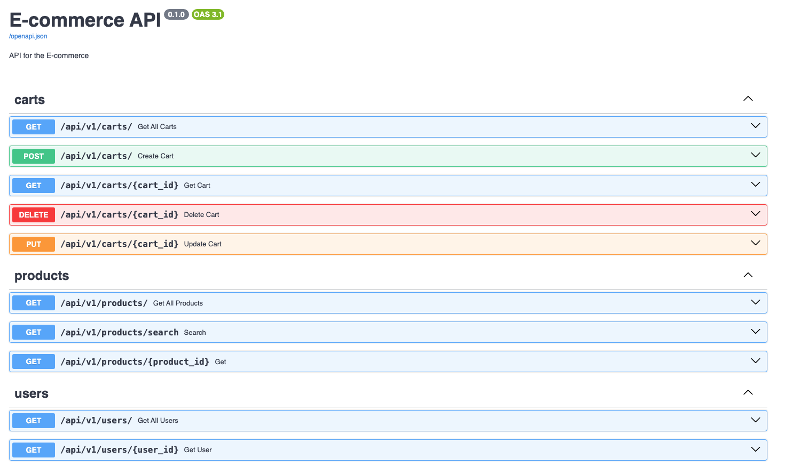
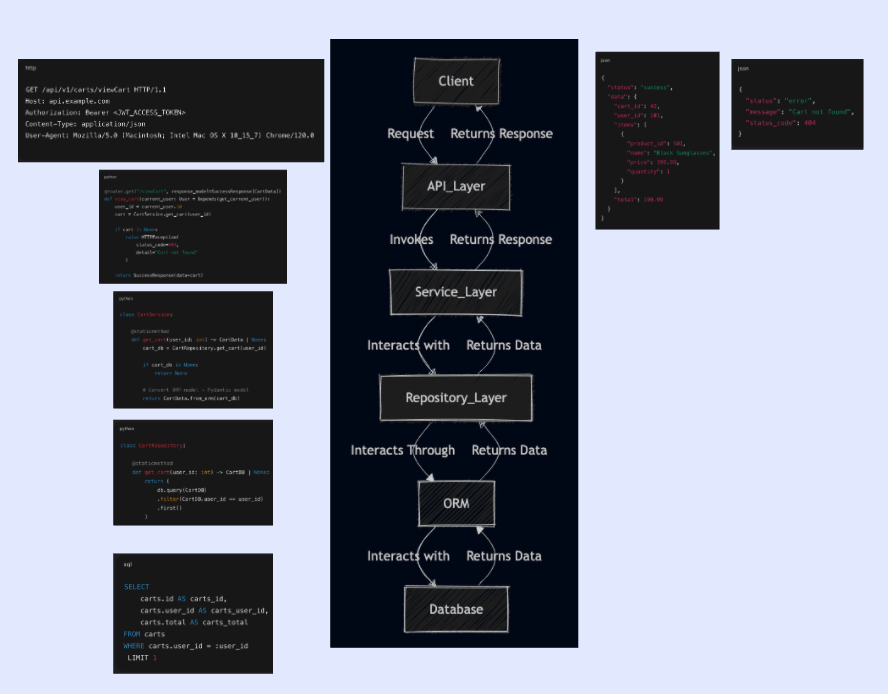

# Ecom Backend Service

## Repo structure


```
.
├── alembic.ini
├── api
│   ├── __init__.py
│   └── v1
│       ├── __init__.py
│       ├── dependencies.py
│       ├── exception_handlers.py
│       ├── router.py
│       └── schemas.py
├── app.py
├── core
│   ├── __init__.py
│   ├── config.py
│   ├── database.py
│   ├── exceptions.py
│   ├── logging.py
│   └── security.py
├── docker-compose.yml
├── Dockerfile
├── docs
│   └── diagrams
│       └── db_diagram.png
├── domains
│   ├── __init__.py
│   ├── accounts
│   │   ├── __init__.py
│   │   └── models.py
│   ├── carts
│   │   ├── __init__.py
│   │   ├── api
│   │   │   ├── __init__.py
│   │   │   ├── dependencies.py
│   │   │   └── router.py
│   │   ├── models.py
│   │   ├── repository.py
│   │   ├── schemas.py
│   │   └── service.py
│   ├── products
│   │   ├── __init__.py
│   │   ├── api
│   │   │   ├── __init__.py
│   │   │   ├── dependencies.py
│   │   │   └── router.py
│   │   ├── models.py
│   │   ├── repository.py
│   │   ├── schemas.py
│   │   └── service.py
│   └── users
│       ├── __init__.py
│       ├── api
│       │   ├── __init__.py
│       │   ├── dependencies.py
│       │   └── router.py
│       ├── models.py
│       ├── repository.py
│       ├── schemas.py
│       └── service.py
├── ecom_backend.db
├── migrations
│   ├── env.py
│   ├── README
│   ├── script.py.mako
│   └── versions
│       └── 8a3fde54fa59_add_tables.py
├── README.md
├── requirements.txt
└── scripts
    ├── add_dummy_data.sql
    └── run_all_migrations.py
    └── ingest_product_data.py

```

## Database Schema

```dbml
Table alembic_version {
  version_num varchar(32) [pk]
}

Table product_hierarchy {
  id integer
  category_id integer [pk]
  subcategory_id integer [pk]
  category_slug varchar
  subcategory_slug varchar
  category_name varchar
  subcategory_name varchar
}

Table user {
  id integer [pk]
  first_name varchar
  last_name varchar
  role varchar(5) [default: 'user']
  created_at timestamp [default: `NOW()`]
}

Table cart {
  id integer [pk]
  user_id integer
  amount float
  created_at timestamp [default: `NOW()`]
}

Table product {
  id integer [pk]
  category_id integer
  subcategory_id integer
  name varchar
  slug varchar
  description varchar
  price float
  created_at timestamp [default: `NOW()`]
}

Table cart_item {
  id integer [pk]
  cart_id integer
  product_id integer
  quantity float
  amount float
}

// Relationships
Ref: user.id < cart.user_id [delete: cascade]
Ref: product_hierarchy.(category_id, subcategory_id) > product.(category_id, subcategory_id) [delete: cascade]
Ref: cart.id < cart_item.cart_id [delete: cascade]
Ref: product.id < cart_item.product_id [delete: cascade]
```


## Ingest Product Data

```bash
python scripts/ingest_product_data.py --reset-db \
--db-url sqlite:///ecom_test.db \
--data-file products_extended.csv \
--data-dir "data" \
```

## Routes

| Route | Description |
| --- | --- |
| `GET /carts` | Get all carts |
| `GET /carts/{cart_id}` | Get a cart by ID |
| `GET /carts/{cart_id}/items` | Get all items in a cart by ID |
| `POST /carts` | Create a new cart |
| `PUT /carts/{cart_id}` | Update a cart by ID |
| `DELETE /carts/{cart_id}` | Delete a cart by ID |

| Route | Description |
| --- | --- |
| `GET /products` | Get all products |
| `GET /products/{product_id}` | Get a product by ID |
| `POST /products` | Create a new product |
| `PUT /products/{product_id}` | Update a product by ID |
| `DELETE /products/{product_id}` | Delete a product by ID |

| Route | Description |
| --- | --- |
| `GET /users` | Get all users |
| `GET /users/{user_id}` | Get a user by ID |
| `POST /users` | Create a new user |
| `PUT /users/{user_id}` | Update a user by ID |
| `DELETE /users/{user_id}` | Delete a user by ID |

---

## Spin up server

```bash
 python app.py
```

## Swagger UI

`http://localhost:8000/api/v1/docs`




## 3 Tier Architecture Example

**NOTE**: I haven't implemented the cart api exactly as below. I realised later that it would have been better to have 1 cart vs multiple carts per user! (TODO: Simplify - for LLM's sake)

| Layer                | Action           | Example                                    |
| -------------------- | ---------------- | ------------------------------------------ |
| **Client**           | Send Request     | GET /api/v1/carts/viewCart with Bearer JWT |
|                      | Receive Response | SuccessResponse[CartData] or 404           |
| **API Layer**        | Invokes          | `CartService.get_cart(user_id)`            |
|                      | Returns          | `CartData`                                 |
| **Service Layer**    | Calls            | `CartRepository.get_cart(user_id)`         |
|                      | Returns          | `CartData`                                 |
| **Repository Layer** | ORM Query        | `db.query(CartDB).filter(...).first()`     |
|                      | Returns          | `CartDB`                                   |
| **ORM Layer**        | SQL Translation  | SELECT ... FROM carts WHERE user_id = ?    |




