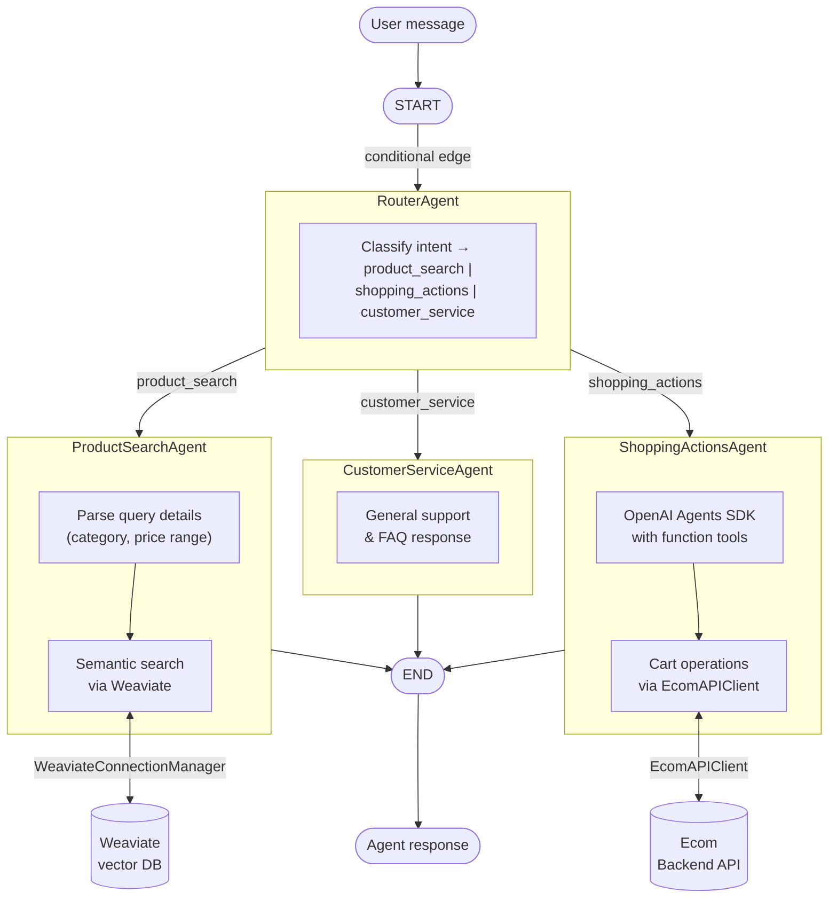

# shopping-assistant

The core GenAI Shopping Assistant package. A multi-agent LLM system that provides a conversational shopping experience through specialized agents orchestrated by LangGraph.

---

## Setting Up Dev Environment

### Prerequisites

- Python 3.12
- [`uv`](https://docs.astral.sh/uv/) — used for virtual environment and dependency management

### Option A: Using Make targets (recommended)

From the **repo root**:

```bash
# Create the dev virtual environment (editable install)
make venv-create COMPONENT=packages/shopping-assistant GROUP=dev

# Activate it
source packages/shopping-assistant/.venv-dev/bin/activate
```

To switch between `dev` and `prod` environments:

```bash
# Switch active venv to dev
make venv-switch COMPONENT=packages/shopping-assistant TARGET=dev

# Then activate
source packages/shopping-assistant/.venv/bin/activate
```

> See the repo root `README.md` and `.claude/rules/venv-management.md` for full venv management documentation.

### Option B: Manual uv install (editable)

From the **repo root**:

```bash
cd packages/shopping-assistant

# Create a virtual environment
uv venv --python 3.12 .venv-dev

# Activate it
source .venv-dev/bin/activate

# Install the package in editable mode with dev dependencies
uv pip install -e "." --group dev
```

## Setting Up External Connections

The package connects to three external services: **Weaviate** (vector search), **Ecom Backend API** (cart and product operations), and an **LLM provider** (OpenAI, Anthropic, or Cohere).

### Get a starter `.env` file

Run the following to scaffold a new project directory with an example config and `.env.example`:

```bash
shopping-assistant create new .
```

This creates `.env.example` (and `config/config.yml`) in the current directory. Copy it to `.env` and fill in your values:

```bash
cp .env.example .env
```

### Weaviate

The package uses `WeaviateConnectionManager` (from `shopping_assistant.product_retrieval`) to manage the Weaviate connection lifecycle. It is constructed from the following env vars:

| Variable | Description | Default |
|---|---|---|
| `WEAVIATE_HTTP_HOST` | Weaviate HTTP host | `localhost` |
| `WEAVIATE_HTTP_PORT` | Weaviate HTTP port | `8080` |
| `WEAVIATE_HTTP_SECURE` | Use HTTPS | `false` |
| `WEAVIATE_GRPC_HOST` | Weaviate gRPC host | `localhost` |
| `WEAVIATE_GRPC_PORT` | Weaviate gRPC port | `50051` |
| `WEAVIATE_GRPC_SECURE` | Use gRPC TLS | `false` |

> For Weaviate setup (Docker, product ingestion, etc.) see the repo root `README.md`.

### Ecom Backend API

The package uses `EcomAPIClient` (from `shopping_assistant.external.ecom_api_client.client`) for all cart and product operations. It is initialised with a `base_url` and optional `Credentials(user_id=...)`.

| Variable | Description | Example |
|---|---|---|
| `ECOM_API_BASE_URL` | Base URL of the ecom backend | `http://localhost:8000/api/v1` |

### LLM Provider API Keys

The package supports OpenAI, Anthropic, and Cohere as LLM providers. Set the key for whichever provider your `config.yml` is configured to use:

| Variable | Provider |
|---|---|
| `OPENAI_API_KEY` | OpenAI |
| `ANTHROPIC_API_KEY` | Anthropic |
| `CO_API_KEY` | Cohere |

Optional base URL overrides (useful for proxies or Azure):

| Variable | Description |
|---|---|
| `OPENAI_BASE_URL` | Custom OpenAI-compatible endpoint |
| `AZURE_OPENAI_ENDPOINT` | Azure OpenAI endpoint |
| `ANTHROPIC_BASE_URL` | Custom Anthropic endpoint |
| `CO_API_URL` | Custom Cohere endpoint |

### Observability (Langfuse)

LLM traces are sent to [Langfuse](https://langfuse.com). These are optional but recommended for monitoring agent behaviour:

| Variable | Description | Default |
|---|---|---|
| `LANGFUSE_PUBLIC_KEY` | Langfuse project public key | — |
| `LANGFUSE_SECRET_KEY` | Langfuse project secret key | — |
| `LANGFUSE_BASE_URL` | Langfuse server URL | `http://localhost:3000` |

> For self-hosted Langfuse setup see `platform/observability/`.

---

## Installing the Package

> **Note:** `shopping-assistant` is not currently published to PyPI. Install directly from GitHub.

### Latest released version

```bash
uv pip install "git+https://github.com/abhi8893/genai-shopping-assistant.git@<version>#subdirectory=packages/shopping-assistant"
```

Replace `<version>` with a release tag (e.g. `v0.1.0`). Available releases can be found on the [GitHub releases page](https://github.com/abhi8893/genai-shopping-assistant/releases).

### Current develop version

To install the latest unreleased code from the `main` branch:

```bash
uv pip install "git+https://github.com/abhi8893/genai-shopping-assistant.git@develop#subdirectory=packages/shopping-assistant"
```

---

## Package Structure

```bash
src/shopping_assistant/
├── agent_definitions/          # Agent prompt definitions and configurations
│   ├── router.py               # RouterAgent — classifies intent and routes to specialist agents
│   ├── product_search.py       # ProductSearchAgent — semantic product discovery via Weaviate
│   ├── shopping_actions.py     # ShoppingActionsAgent — cart, checkout, and order operations
│   └── customer_service.py     # CustomerServiceAgent — general support and FAQs
├── graph/                      # LangGraph orchestration
│   ├── graph.py                # Multi-agent graph definition and entrypoint
│   ├── types.py                # Graph state types
│   └── utils.py                # Graph utility helpers
├── external/
│   └── ecom_api_client/        # HTTP client for the Ecom Backend API
│       ├── client.py           # EcomAPIClient — top-level client
│       ├── credentials.py      # Credentials model
│       ├── http.py             # Base HTTP transport
│       └── resources/
│           ├── carts/          # Cart API resource (client + types)
│           └── products/       # Products API resource (client + types)
├── tools/                      # Agent tools
│   └── cart_actions.py         # ShoppingActions agent cart action tools wrapping EcomAPIClient cart operations
├── observability/
│   ├── utils.py                # Langfuse + logfire setup
│   └── preflight.py            # Connectivity pre-flight checks
├── config/
│   └── config.yml              # Default agent and LLM configuration
├── chat.py                     # Chat — high-level Python API (CLI and web UI)
├── cli.py                      # CLI entrypoint (shopping-assistant commands)
├── config.py                   # Config loader
├── product_retrieval.py        # product retrieval with weaviate
├── env.py                      # .env file loader
└── types.py                    # Shared types
```

---

## Architecture

The package implements a **multi-agent LangGraph pipeline**. A central `RouterAgent` classifies every user message and dispatches it to one of three specialist agents. Each agent runs independently and writes its response back to the shared graph `State`.

### Agents

| Agent | Role | LLM Framework | External Dependency |
|---|---|---|---|
| `RouterAgent` | Classifies user intent and routes to the correct specialist | OpenAI structured output (`parse`) | — |
| `ProductSearchAgent` | Parses product query, runs semantic search, returns matching products | OpenAI chat | Weaviate (vector DB) |
| `ShoppingActionsAgent` | Manages cart operations (add, remove, view, checkout) via function tools | OpenAI Agents SDK (`Agent` + `Runner`) | Ecom Backend API |
| `CustomerServiceAgent` | Handles general support, FAQs, and off-topic queries | OpenAI chat | — |

### Graph Flow



### Graph State

All agents read from and write to a shared `State` object:

| Field | Type | Description |
|---|---|---|
| `messages` | `list` | Accumulated OpenAI-format conversation messages |
| `prev_recommended_products` | `list[ProductVectorDBRecord] \| None` | Products recommended in the current session |
| `last_response_agent` | `str \| None` | Name of the agent that produced the last response |


---

## RouterAgent

The `RouterAgent` is the graph entrypoint. It inspects the conversation history and returns the name of the downstream route to execute. It never produces a user-facing message itself. It is based on OpenAI's `parse` structured output.

The three routes and representative examples from the default config:

| Route | Example queries |
|---|---|
| `product_search` | "I am looking for headphones under 2000 rupees.", "Do you have wind cheaters in red?" |
| `shopping_actions` | "Can you add this to the cart?", "I want to place an order for this product." |
| `customer_service` | "Hello!", "Can you tell me the return policy?" |

### Prompt

Configured under `agents.router` in `config.yml`. The system prompt instructs the agent to analyse the conversation and select the correct route. The `{downstream_routes_desc}` placeholder is populated at runtime from the `downstream_routes` list, which includes each route's name, description, and example queries.

```
You are a helpful ecom shopping assistant tasked with redirecting the user
to the appropriate specialized downstream routes.
Analyze the provided conversation history with the user to re-examine if
you are the right agent to answer the user's query.
...
{downstream_routes_desc}

Please respond ONLY with the name of the appropriate downstream route
based on the user's query.
```

### Python API

```python
from shopping_assistant.agent_definitions import RouterAgent
from shopping_assistant.config import load_config

config = load_config()  # loads default config.yml
router = RouterAgent(config=config["agents"]["router"])
```

`RouterAgent` constructor accepts:

| Parameter | Type | Description |
|---|---|---|
| `config` | `dict` | Agent config block (`config["agents"]["router"]`) |
| `openai_client` | `openai.OpenAI \| None` | Optional pre-configured OpenAI client; defaults to `openai.OpenAI()` |

### Usage

`RouterAgent.run(state)` is called by LangGraph as a conditional edge from `START`. It can also be called directly:

```python
from shopping_assistant.agent_definitions import RouterAgent
from shopping_assistant.config import load_config
from shopping_assistant.graph.types import State

config = load_config()
router = RouterAgent(config=config["agents"]["router"])

queries = [
    "I am looking for headphones under 2000 rupees",
    "Add the first item to my cart",
    "What is your return policy?",
]

for query in queries:
    state = State(messages=[{"role": "user", "content": query}])
    route = router.run(state)
    print(f"Query : {query!r}")
    print(f"Route : {route!r}")
    print()
```

### Output

Returns one of the three route name strings — used by LangGraph to select the next node:

```
"product_search" | "shopping_actions" | "customer_service"
```

Example output:

```
Query : 'I am looking for black sunglasses under 100$'
Route : 'product_search'

Query : 'Add the first item to my cart'
Route : 'shopping_actions'

Query : 'What is your return policy?'
Route : 'customer_service'
```
