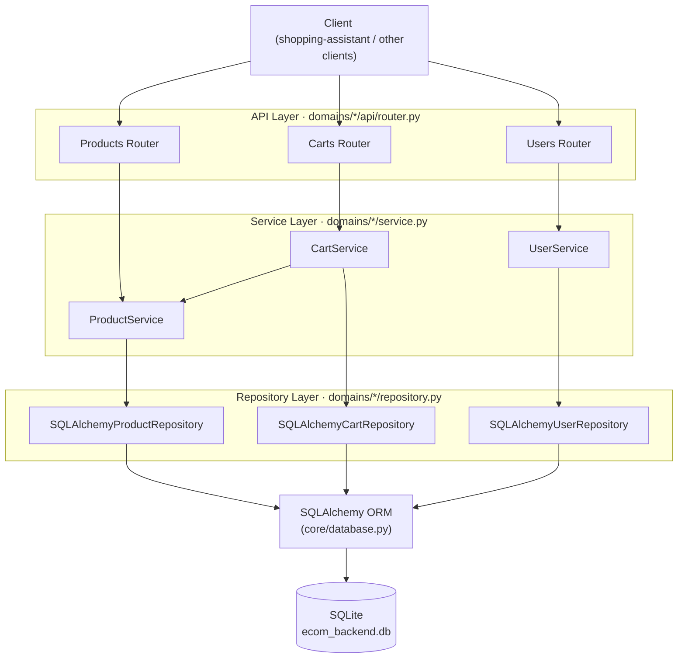
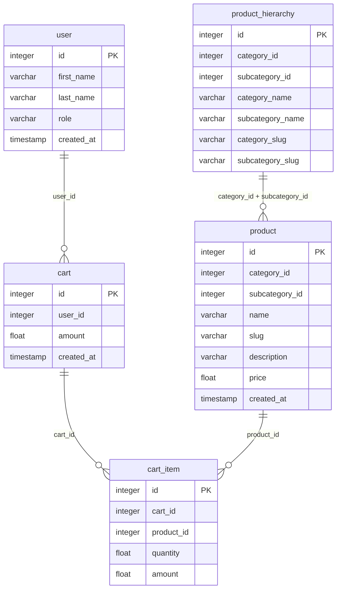

# Ecom Backend Service

An auxiliary FastAPI service that provides e-commerce operations (products, carts, users) for the GenAI Shopping Assistant. It demonstrates how the shopping assistant integrates with a real e-commerce backend.

> **Note**: In the target architecture (v1.x+), this service will be replaceable with standard e-commerce platforms (Shopify, WooCommerce) via Bring-YOS integrations.

---

## Table of Contents

1. [Dev Environment Setup](#1-dev-environment-setup)
2. [Dockerfile](#2-dockerfile)
3. [External Connections & Environment Variables](#3-external-connections--environment-variables)
4. [How to Run](#4-how-to-run)
5. [Directory Tree](#5-directory-tree)
6. [Architecture](#6-architecture)
7. [DB Schema](#7-db-schema)
8. [API Routes](#8-api-routes)
9. [Domain: Products](#9-domain-products)
10. [Domain: Carts](#10-domain-carts)
11. [Domain: Users](#11-domain-users)
12. [Authentication & Authorization](#12-authentication--authorization)

---

## 1. Dev Environment Setup

### Option A — Make targets (recommended)

```bash
# Create a dev virtual environment for this service
make venv-create COMPONENT=services/ecom-backend GROUP=dev

# Activate it
make venv-switch COMPONENT=services/ecom-backend TARGET=dev
source services/ecom-backend/.venv/bin/activate
```

### Option B — Manual uv

```bash
cd services/ecom-backend

uv venv --python 3.12 .venv-dev
uv pip install --system -e . --group dev
source .venv-dev/bin/activate
```

### Local `.env`

The service reads `DB_NAME` from a `.env` file in the working directory. Create one locally:

```bash
# services/ecom-backend/.env
DB_NAME=ecom_backend
```

---

## 2. Dockerfile

The `Dockerfile` uses a two-stage build sharing a common `base` stage:

```
base (python:3.12-slim, installs uv)
 ├── dev   — editable install, source volume-mounted, uvicorn --reload
 └── prod  — full source copy, locked deps, no --reload
```

### `dev` target

- Copies only `pyproject.toml` into the image; source code is **volume-mounted** at runtime (`docker-compose.dev.yml`).
- Installs dependencies with `uv pip install --system -e . --group dev` (editable install).
- Runs `uvicorn app:app --host 0.0.0.0 --port 8000 --reload`.

### `prod` target

- Copies the full source into the image.
- Sets `UV_PROJECT_ENVIRONMENT="/usr/local/"` so `uv sync` installs packages system-wide (no separate venv inside the container).
- Installs locked production-only deps with `uv sync --locked --no-dev`.
- Runs `uvicorn app:app --host 0.0.0.0 --port 8000` (no `--reload`).

---

## 3. External Connections & Environment Variables

| Variable | Description | Example |
|---|---|---|
| `ECOM_API_PORT` | Port the service listens on | `8000` |
| `ECOM_API_BASE_URL` | Full base URL (used by the shopping-assistant service) | `http://ecom-backend:8000/api/v1` |
| `DB_NAME` | SQLite database filename (without `.db` extension) | `ecom_backend` |

These are defined in `platform/app/.env` (prod) and `platform/app/.env.dev` (dev overlay).

**External dependency**: SQLite file `{DB_NAME}.db`. The file is created automatically on first run via Alembic migrations; no external database server is required.

---

## 4. How to Run

Environment variables are configured in `platform/app/.env` (prod) and `platform/app/.env.dev` (dev). Run from the repo root:

```bash
# Dev mode (source volume-mounted, hot reload)
make app-dev SERVICES=ecom-backend

# Dev mode + Langfuse observability
make local-run-dev SERVICES=ecom-backend

# Prod mode
make app-prod SERVICES=ecom-backend
```

### Run locally (without Docker)

```bash
cd services/ecom-backend
python app.py  # runs on http://localhost:8000
```

**Swagger UI**: `http://localhost:8000/api/v1/docs`

---

## 5. Directory Tree

```
services/ecom-backend/
├── app.py                      # App entrypoint: FastAPI app, CORS, versioned mounts
├── alembic.ini                 # Alembic migration config
├── pyproject.toml
├── Dockerfile
├── api/
│   └── v1/
│       ├── dependencies.py
│       ├── exception_handlers.py
│       ├── router.py           # Aggregates domain routers under /api/v1
│       └── schemas.py
├── core/
│   ├── config.py               # Settings (reads DB_NAME from .env)
│   ├── database.py             # SQLite engine + SQLAlchemy session factory
│   ├── exceptions.py           # Domain exception types
│   ├── logging.py
│   └── security.py
├── domains/
│   ├── carts/
│   │   ├── models.py           # CartDB, CartItemDB (SQLAlchemy)
│   │   ├── schemas.py          # CartCreate, CartUpdate, CartData, CartItemData (Pydantic)
│   │   ├── service.py          # CartService
│   │   ├── repository.py       # CartRepository (ABC) + SQLAlchemyCartRepository
│   │   └── api/
│   │       ├── dependencies.py
│   │       └── router.py
│   ├── products/
│   │   ├── models.py           # ProductDB, ProductHierarchyDB (SQLAlchemy)
│   │   ├── schemas.py          # ProductCreate, ProductUpdate, ProductData (Pydantic)
│   │   ├── service.py          # ProductService
│   │   ├── repository.py       # ProductRepository (ABC) + SQLAlchemyProductRepository
│   │   ├── types.py            # ProductHierarchyFilter
│   │   └── api/
│   │       ├── dependencies.py
│   │       └── router.py
│   └── users/
│       ├── models.py           # UserDB (SQLAlchemy)
│       ├── schemas.py          # UserData (Pydantic)
│       ├── service.py          # UserService
│       ├── repository.py       # UserRepository (ABC) + SQLAlchemyUserRepository
│       └── api/
│           ├── dependencies.py # get_current_user (X-User-Id header)
│           └── router.py
├── migrations/
│   └── versions/
│       ├── 8a3fde54fa59_add_tables.py
│       └── f9c2f0462ab9_add_slug_to_products_tables.py
└── scripts/
    └── ingest_product_data.py
```

---

## 6. Architecture

The service follows a 3-tier architecture. Each domain is self-contained with its own API, service, and repository layers.



| Layer | Files | Responsibility |
|---|---|---|
| API | `domains/*/api/router.py` | HTTP routing, request validation, response serialization |
| Service | `domains/*/service.py` | Business logic, domain rules, orchestration |
| Repository | `domains/*/repository.py` | Data access abstraction (abstract base + SQLAlchemy implementation) |
| ORM | SQLAlchemy via `core/database.py` | Object-relational mapping |
| Database | SQLite (`ecom_backend.db`) | Persistence |

---

## 7. DB Schema

Source: [`docs/diagrams/db_diagram.dbml`](docs/diagrams/db_diagram.dbml)



**Key notes**:
- `product_hierarchy` uses a composite unique key `(category_id, subcategory_id)`.
- `product` references `product_hierarchy` via the composite FK `(category_id, subcategory_id)` with `ON DELETE CASCADE`.
- `cart_item` references both `cart` and `product` with `ON DELETE CASCADE`.

---

## 8. API Routes

All routes are mounted under `/api/v1`. The root app exposes a `/health` endpoint.

### Health

| Method | Path | Description |
|---|---|---|
| `GET` | `/health` | Service health check |

### Products (prefix: `/products`)

| Method | Path | Description |
|---|---|---|
| `GET` | `/` | List all products (paginated: `page`, `limit`) |
| `GET` | `/search` | Search with optional hierarchy filters + `keywords` |
| `GET` | `/id/{product_id}` | Get product by ID |
| `GET` | `/slug/{product_slug}` | Get product by slug |
| `GET` | `/category/id/{category_id}` | Products by category ID |
| `GET` | `/subcategory/id/{subcategory_id}` | Products by subcategory ID |
| `GET` | `/category/slug/{category_slug}` | Products by category slug |
| `GET` | `/subcategory/slug/{subcategory_slug}` | Products by subcategory slug |

### Carts (prefix: `/carts`, all require `X-User-Id` header)

| Method | Path | Description |
|---|---|---|
| `GET` | `/` | List user's carts |
| `GET` | `/{cart_id}` | Get cart by ID |
| `POST` | `/` | Create new cart |
| `PUT` | `/{cart_id}` | Replace cart items |
| `DELETE` | `/{cart_id}` | Delete cart |

### Users (prefix: `/users`)

| Method | Path | Description |
|---|---|---|
| `GET` | `/` | List users (paginated: `page`, `limit`) |
| `GET` | `/{user_id}` | Get user by ID |

---

## 9. Domain: Products

### Models (`domains/products/models.py`)

**`ProductDB`** (`product` table):

| Column | Type | Notes |
|---|---|---|
| `id` | `Integer` | Primary key, autoincrement |
| `category_id` | `Integer` | Part of composite FK → `product_hierarchy` |
| `subcategory_id` | `Integer` | Part of composite FK → `product_hierarchy` |
| `name` | `String` | Not null |
| `slug` | `String` | URL-friendly identifier, not null |
| `description` | `String` | Not null |
| `price` | `Float` | Not null |
| `created_at` | `TIMESTAMP` | Server default `NOW()` |

**`ProductHierarchyDB`** (`product_hierarchy` table):

| Column | Type | Notes |
|---|---|---|
| `id` | `Integer` | Primary key, autoincrement |
| `category_id` | `Integer` | Part of composite PK `(category_id, subcategory_id)` |
| `subcategory_id` | `Integer` | Part of composite PK |
| `category_name` | `String` | Not null |
| `subcategory_name` | `String` | Not null |
| `category_slug` | `String` | Not null |
| `subcategory_slug` | `String` | Not null |

### Schemas (`domains/products/schemas.py`)

| Schema | Direction | Fields |
|---|---|---|
| `ProductCreate` | Input | `name`, `slug`, `description`, `price`, `category_id`, `subcategory_id` |
| `ProductUpdate` | Input | Same fields as `ProductCreate`, all optional (min 1 required) |
| `ProductData` | Output | `id`, `name`, `slug`, `description`, `price`, `category_id`, `subcategory_id` |

### Repository (`domains/products/repository.py`)

Abstract interface `ProductRepository` with `SQLAlchemyProductRepository` implementation:

| Method | Signature | Description |
|---|---|---|
| `get_all` | `(page, limit) → list[ProductDB]` | Paginated product list |
| `get` | `(product_id) → ProductDB` | Fetch by primary key |
| `create` | `(product: ProductDB) → ProductDB` | Insert new product |
| `update` | `(product: ProductDB) → ProductDB` | Commit changes to existing product |
| `delete` | `(product_id) → None` | Delete by ID |
| `get_by_hierarchy` | `(hierarchy_filter, page, limit) → list[ProductDB]` | Filter by category/subcategory |
| `search` | `(page, limit, hierarchy_filter, keywords) → list[ProductDB]` | Combined hierarchy + keyword search |

### Service (`domains/products/service.py`)

`ProductService` wraps the repository and handles schema validation:

| Method | Description |
|---|---|
| `get(product_id)` | Fetch product, return `ProductData` |
| `get_all(page, limit)` | Paginated list, return `list[ProductData]` |
| `get_by_hierarchy(hierarchy_filter, page, limit)` | Filter by hierarchy |
| `search(page, limit, hierarchy_filter, keywords)` | Combined search |
| `create(product_create_data)` | Create product from `ProductCreate` schema |
| `update(product_id, product_update_data)` | Partial update from `ProductUpdate` schema |
| `delete(product_id)` | Delete product |

### Example: List products

```bash
curl -s http://localhost:8000/api/v1/products/?page=1&limit=2
```

```json
[
  {
    "id": 1,
    "name": "Southwest Bracelet",
    "slug": "southwest-bracelet",
    "description": "The Southwest Bracelet combines elegance with a touch of American Indian glamour. This jeweled bracelet is perfect for making a statement ...",
    "price": 169.99,
    "category_id": 4,
    "subcategory_id": 2
  },
  {
    "id": 2,
    "name": "Jeweled Bracelet Watch",
    "slug": "jeweled-bracelet-watch",
    "description": "Introducing the Jeweled Bracelet Watch, a stylish accessory that combines elegance with a touch of ...",
    "price": 259.99,
    "category_id": 4,
    "subcategory_id": 2
  }
]
```

### Example: Keyword search

```bash
curl -s "http://localhost:8000/api/v1/products/search?keywords=bag&page=1&limit=2"
```

```json
[
  {
    "id": 25,
    "name": "Fusion Leather Crossbody Bag",
    "slug": "fusion-leather-crossbody-bag",
    "description": "The Fusion Leather Crossbody Bag combines modern simplicity with timeless elegance, making it a perfect companion for any occasion. This versatile crossbody ...",
    "price": 109.99,
    "category_id": 1,
    "subcategory_id": 1
  },
  {
    "id": 29,
    "name": "Kaleidoscope Crossbody Bag",
    "slug": "kaleidoscope-crossbody-bag",
    "description": "The Kaleidoscope Crossbody Bag is a vibrant and versatile accessory that brings a touch of modern flair ...",
    "price": 119.99,
    "category_id": 1,
    "subcategory_id": 1
  }
]
```

> See `playground/ecom-backend/scripts/explore_products_api.sh` for more examples.

---

## 10. Domain: Carts

### Models (`domains/carts/models.py`)

**`CartDB`** (`cart` table):

| Column | Type | Notes |
|---|---|---|
| `id` | `Integer` | Primary key |
| `user_id` | `Integer` | FK → `user.id` (`ON DELETE CASCADE`) |
| `amount` | `Float` | Total cart value |
| `created_at` | `TIMESTAMP` | Default `now()` |

**`CartItemDB`** (`cart_item` table):

| Column | Type | Notes |
|---|---|---|
| `id` | `Integer` | Primary key, autoincrement |
| `cart_id` | `Integer` | FK → `cart.id` (`ON DELETE CASCADE`) |
| `product_id` | `Integer` | FK → `product.id` (`ON DELETE CASCADE`) |
| `quantity` | `Float` | Number of units |
| `amount` | `Float` | `price × quantity` |

### Schemas (`domains/carts/schemas.py`)

| Schema | Direction | Fields |
|---|---|---|
| `CartItemCreate` | Input | `product_id: int`, `quantity: int` |
| `CartCreate` | Input | `cart_items: list[CartItemCreate]` |
| `CartUpdate` | Input | `cart_items: list[CartItemCreate]` |
| `CartItemData` | Output | `id`, `product_id`, `quantity`, `amount` |
| `CartData` | Output | `id`, `user_id`, `created_at`, `cart_items: list[CartItemData]` |

### Repository (`domains/carts/repository.py`)

Abstract interface `CartRepository` with `SQLAlchemyCartRepository` implementation:

| Method | Signature | Description |
|---|---|---|
| `get_all` | `(user_id, page, limit) → list[CartDB]` | User's paginated carts |
| `get` | `(cart_id) → CartDB` | Fetch by cart ID |
| `create` | `(cart: CartDB) → CartDB` | Insert new cart |
| `update` | `(cart: CartDB) → CartDB` | Commit changes |
| `delete` | `(cart_id) → None` | Delete cart (cascades to items) |
| `empty_cart` | `(cart_id) → None` | Remove all items without deleting the cart |

### Service (`domains/carts/service.py`)

`CartService` orchestrates cart operations and delegates product price lookups to `ProductService`:

| Method | Description |
|---|---|
| `get_all(user_id, page, limit)` | List user carts; auto-creates an empty cart if none exist |
| `get(cart_id)` | Fetch cart by ID |
| `create(cart_create_data, user_id)` | Create cart; validates products + computes amounts |
| `update(cart_update_data, cart_id)` | Replace cart items (empties then repopulates) |
| `empty_cart(cart_id)` | Remove all cart items |
| `delete(cart_id)` | Delete cart and return snapshot |

### Example: Get user carts

```bash
curl -s http://localhost:8000/api/v1/carts/ \
  -H "X-User-Id: 1"
```

```json
[
  {
    "id": 1,
    "user_id": 1,
    "created_at": "2024-01-15T10:30:00+00:00",
    "cart_items": [
      {"id": 1, "product_id": 1, "quantity": 2, "amount": 3999.98},
      {"id": 2, "product_id": 2, "quantity": 1, "amount": 349.99}
    ]
  }
]
```

### Example: Create a cart

```bash
curl -s -X POST http://localhost:8000/api/v1/carts/ \
  -H "Content-Type: application/json" \
  -H "X-User-Id: 1" \
  -d '{"cart_items": [{"product_id": 1, "quantity": 2}]}'
```

```json
{
  "id": 2,
  "user_id": 1,
  "created_at": "2024-01-15T11:00:00+00:00",
  "cart_items": [
    {"id": 3, "product_id": 1, "quantity": 2, "amount": 3999.98}
  ]
}
```

> See `playground/ecom-backend/scripts/explore_carts_api.sh` for full CRUD examples.

---

## 11. Domain: Users

### Models (`domains/users/models.py`)

**`UserDB`** (`user` table):

| Column | Type | Notes |
|---|---|---|
| `id` | `Integer` | Primary key, autoincrement |
| `first_name` | `String` | Not null |
| `last_name` | `String` | Not null |
| `role` | `Enum('admin', 'user')` | Server default `'user'` |
| `created_at` | `TIMESTAMP` | Server default `NOW()` |

### Schemas (`domains/users/schemas.py`)

| Schema | Direction | Fields |
|---|---|---|
| `UserData` | Output | `id`, `first_name`, `last_name`, `role`, `created_at` |

### Repository (`domains/users/repository.py`)

Abstract interface `UserRepository` with `SQLAlchemyUserRepository` implementation:

| Method | Signature | Description |
|---|---|---|
| `create` | `(user: UserDB) → UserDB` | Insert new user |
| `get` | `(user_id) → UserDB` | Fetch by primary key |
| `get_all` | `(page, limit) → list[UserDB]` | Paginated user list |

### Service (`domains/users/service.py`)

`UserService` wraps the repository:

| Method | Description |
|---|---|
| `get(user_id)` | Fetch user, return `UserData` |
| `get_all(page, limit)` | Paginated list, return `list[UserData]` |

### Example: List users

```bash
curl -s "http://localhost:8000/api/v1/users/?page=1&limit=5"
```

```json
[
  {
    "id": 1,
    "first_name": "John",
    "last_name": "Doe",
    "role": "user",
    "created_at": "2025-12-03T08:07:01"
  },
  {
    "id": 2,
    "first_name": "Jane",
    "last_name": "Smith",
    "role": "admin",
    "created_at": "2025-12-03T08:07:01"
  },
  {
    "id": 3,
    "first_name": "Bob",
    "last_name": "Johnson",
    "role": "user",
    "created_at": "2025-12-03T08:07:01"
  },
  {
    "id": 4,
    "first_name": "Alice",
    "last_name": "Williams",
    "role": "user",
    "created_at": "2025-12-03T08:07:01"
  }
]
```

### Example: Get user by ID

```bash
curl -s http://localhost:8000/api/v1/users/1
```

```json
{
  "id": 1,
  "first_name": "John",
  "last_name": "Doe",
  "role": "user",
  "created_at": "2025-12-03T08:07:01"
}
```

> See `playground/ecom-backend/scripts/explore_users_api.sh` for more examples.

---

## 12. Authentication & Authorization

### Current implementation (temporary)

All cart endpoints are protected by `get_current_user` (`domains/users/api/dependencies.py`). This dependency reads the `X-User-Id` HTTP header and looks up the user in the database:

```python
def get_current_user(
    db: Session = Depends(get_db),
    user_id: int | None = Header(default=None, alias="X-User-Id"),
):
    """
    Temporary simplified auth:
    Reads user id from header: X-User-Id: <int>
    """
    if user_id is None:
        raise UnauthorizedException(message="X-User-Id header is missing")

    user = db.query(UserDB).filter(UserDB.id == user_id).first()

    if user is None:
        raise ResourceNotFoundException(message="User not found")

    return user
```

**Protected routes** (all in `domains/carts/api/router.py`):

| Handler | Method + Path |
|---|---|
| `get_all_carts` | `GET /carts/` |
| `get_cart` | `GET /carts/{cart_id}` |
| `create_cart` | `POST /carts/` |
| `update_cart` | `PUT /carts/{cart_id}` |
| `delete_cart` | `DELETE /carts/{cart_id}` |

**Usage:**

```bash
curl -H "X-User-Id: 1" http://localhost:8000/api/v1/carts/
```

**Error responses:**

- Missing header → `401 Unauthorized`
- User ID not found in DB → `404 Not Found`

> **Future**: This simplified header-based auth is a placeholder. It will be replaced with proper JWT-based (or other) authentication in a future release.
