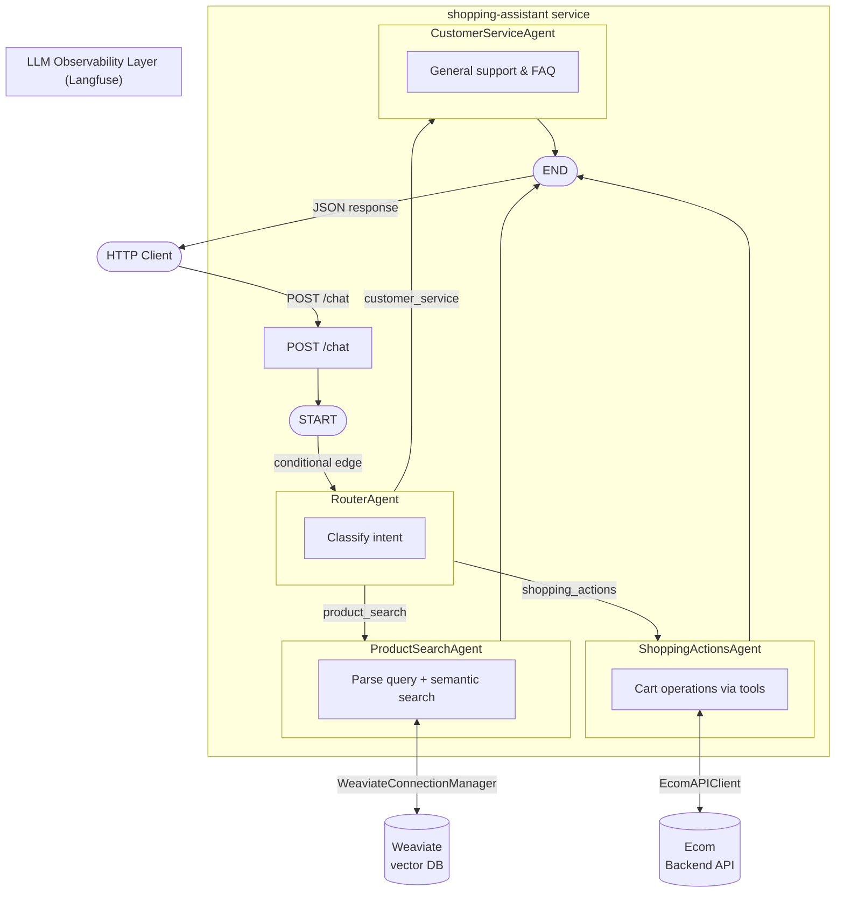

# shopping-assistant service

The FastAPI web app service that exposes the GenAI Shopping Assistant, backed by the [`shopping-assistant`](../../packages/shopping-assistant/README.md) package.

---

## Setting Up Dev Environment

### Prerequisites

- Python 3.12
- [`uv`](https://docs.astral.sh/uv/) — used for virtual environment and dependency management

### Option A: Using Make targets (recommended)

From the **repo root**:

```bash
# Create the dev virtual environment (editable install)
make venv-create COMPONENT=services/shopping-assistant GROUP=dev

# Activate it
source services/shopping-assistant/.venv-dev/bin/activate
```

To switch between `dev` and `prod` environments:

```bash
# Switch active venv to dev
make venv-switch COMPONENT=services/shopping-assistant TARGET=dev

# Then activate
source services/shopping-assistant/.venv/bin/activate
```

> See the repo root `README.md` and `.claude/rules/venv-management.md` for full venv management documentation.

### Option B: Manual uv install (editable)

From the **repo root**:

```bash
cd services/shopping-assistant

# Create a virtual environment
uv venv --python 3.12 .venv-dev

# Activate it
source .venv-dev/bin/activate

# Install the package in editable mode with dev dependencies
uv pip install -e "." --group dev
```

---

## Dockerfile

The Dockerfile uses a **multi-stage build** with a shared `base` stage and two targets: `dev` and `prod`.

### Base stage

Starts from `python:3.12-slim`, installs `uv`, and sets `/project` as the working directory.

### Dev target

- Copies `pyproject.toml` manifests first to maximise Docker layer caching
- Copies the full service and package source (these are overridden by volume mounts at runtime, enabling hot reload)
- Installs both the service and the `packages/shopping-assistant` package as **editable installs** (`-e`) with dev dependencies
- Runs `uvicorn` with `--reload` on port `8010`

To build and run the dev target, use the make target from the **repo root**:

```bash
make app-dev SERVICES=shopping-assistant
```

### Prod target

- Copies source directly (no volume mounts)
- Installs dependencies via `uv sync --locked --no-dev` — **no editable installs**, uses the lock file, dev dependencies excluded
- Runs `uvicorn` without `--reload` on port `8010`

To build and run the prod target, use the make target from the **repo root**:

```bash
make app-prod SERVICES=shopping-assistant
```

---

## Setting Up External Connections

### Service port

| Variable | Description | Internal Port | Forwarded Port |
|---|---|---|---|
| `SHOPPING_ASSISTANT_PORT` | Port this service listens on | `8010` | `8010` |

### External services

This service connects to the following external services at runtime:

| Service | Purpose |
|---|---|
| Weaviate | Vector search for product retrieval |
| Ecom Backend API | Cart and product operations |
| LLM provider | OpenAI / Anthropic / Cohere |
| Langfuse | LLM observability (optional) |

For the full list of env vars for each of these services, see [Setting Up External Connections](../../packages/shopping-assistant/README.md#setting-up-external-connections) in the `packages/shopping-assistant` README.

---

## How to Run

Environment variables are configured in the `platform/app/` directory. Use the provided example files as a reference:

- `platform/app/.env.example` — prod
- `platform/app/.env.dev.example` — dev

Copy the relevant example to `.env` / `.env.dev` and fill in your values before running.

To run the service via Docker Compose from the **repo root**:

```bash
# Dev (hot reload, editable installs)
make app-dev SERVICES=shopping-assistant

# Prod
make app-prod SERVICES=shopping-assistant
```

---

## Tree Structure

```
services/shopping-assistant/
├── app.py                          # FastAPI app — routes and startup
├── Dockerfile                      # Multi-stage build (dev / prod)
├── pyproject.toml                  # Dependencies and build config
├── uv.lock                         # Locked dependency versions
├── .shopping-assistant/
│   └── config/config.yml           # Agent and LLM config (overrides package default)
└── scripts/
    └── ingest_product_data_into_vectorstore.py  # One-off product ingestion script
```

---

## Architecture

The service exposes a single `POST /chat` endpoint that drives the multi-agent LangGraph pipeline from the `shopping-assistant` package.



For agent-level architecture details (agent prompts, graph state, routing logic), see the [Architecture](../../packages/shopping-assistant/README.md#architecture) section of the `packages/shopping-assistant` README.

---

## API Routes

| Method | Route | Description |
|---|---|---|
| `GET` | `/` | Service info and available endpoints |
| `GET` | `/health` | Health check |
| `POST` | `/chat` | Send a message to the shopping assistant |

### `POST /chat` request body

| Field | Type | Description |
|---|---|---|
| `user_id` | `str` | User identifier |
| `thread_id` | `str` | Conversation thread identifier |
| `query` | `str` | User message |

---

